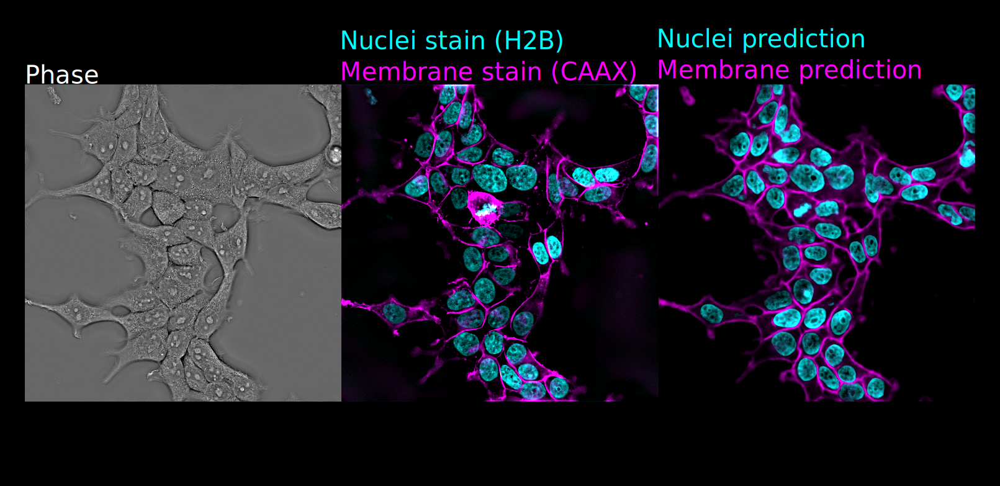

# viscy

viscy is a machine learning toolkit to solve computer vision problems
in high-throughput imaging of cells.



## Installation

(Optional) create a new virtual/Conda environment.

Clone this repository and install viscy:

```sh
git clone https://github.com/mehta-lab/viscy.git
pip install viscy
```

Verify installation by accessing the CLI help message:

```sh
viscy --help
```

For development installation, see [the contributing guide](CONTRIBUTING.md).

Full functionality is only tested on Linux `x86_64` with NVIDIA Ampere GPUs (CUDA 12.0).
Some features (e.g. mixed precision and distributed training) may not work with other setups,
see [PyTorch documentation](https://pytorch.org) for details.

## Predicting sub-cellular structure from label-free images

Predicting sub-cellular landmarks such as nuclei and membrane from label-free (e.g. phase) images
can improve imaging throughput and ease experiment design.
However, training a model directly for segmentation requires laborious manual annotation.
We use fluorescent markers as a proxy of supervision with human-annotated labels,
and turn this instance segmentation problem into a paired image-to-image translation (I2I) problem.

viscy features an end-to-end pipeline to design, train and evaluate I2I models in a declarative manner.
It supports 2D, 2.5D (3D encoder, 2D decoder) and 3D U-Nets,
as well as 3D networks with anisotropic filters.


