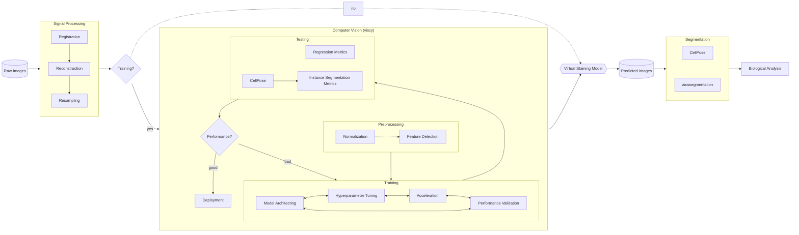

# VisCy

VisCy is a deep learning pipeline for training and deploying computer vision models for image-based phenotyping at single cell resolution.

The current focus of the pipeline is on the image translation models for virtual staining of multiple cellular compartments from label-free images.
We are building these models for simultaneous segmentation of nuclei and membrane, which are the first steps in a single-cell phenotyping pipeline.
Our pipeline also provides utilities to export the models to ONNX format for use at runtime.
We will grow the collection of the models suitable for high-throughput imaging and phenotyping.
Expect rough edges until we release a PyPI package.


This pipeline evolved from the [TensorFlow version of virtual staining pipeline](https://github.com/mehta-lab/microDL), which we reported in [this paper in 2020](https://elifesciences.org/articles/55502). The previous pipeline is now a public archive, and we will be focusing our efforts on VisCy.

## Installing viscy

1. We highly encourage using a new Conda/virtual environment.
    The example below uses [Mamba](https://github.com/mamba-org/mamba),
    a faster re-implementation of Conda.

    ```sh
    mamba create --name viscy python=3.10
    # OR specify a custom path since the dependencies are large
    mamba create --prefix /path/to/conda/envs/viscy python=3.10
    ```

2. Clone this repository and install with pip:

    ```sh
    git clone https://github.com/mehta-lab/VisCy.git
    # change to project root directory (parent folder of pyproject.toml)
    cd VisCy
    pip install .
    ```

    If evaluating virtually stained images for segmentation tasks,
    install additional dependencies:

    ```sh
    pip install ".[metrics]"
    ```

    Visualizing the model architecture requires `visual` dependencies:

    ```sh
    pip install ".[visual]"
    ```

3. Verify installation by accessing the CLI help message:

    ```sh
    viscy --help
    ```

For development installation, see [the contributing guide](CONTRIBUTING.md).

The pipeline is built using the [PyTorch Lightning](https://www.pytorchlightning.ai/index.html) framework.
The [iohub](https://github.com/czbiohub-sf/iohub) library is used
for reading and writing data in [OME-Zarr](https://www.nature.com/articles/s41592-021-01326-w) format.

The full functionality is only tested on Linux `x86_64` with NVIDIA Ampere GPUs (CUDA 12.3).
Some features (e.g. mixed precision and distributed training) may not work with other setups,
see [PyTorch documentation](https://pytorch.org) for details.

## Virtual staining of cellular compartments from label-free images

Predicting sub-cellular landmarks such as nuclei and membrane from label-free (e.g. phase) images
can improve imaging throughput and ease experiment design.
However, training a model directly for segmentation requires laborious manual annotation.
We use fluorescent markers as a proxy of supervision with human-annotated labels,
and turn this instance segmentation problem into a paired image-to-image translation (I2I) problem.

viscy features an end-to-end pipeline to design, train and evaluate I2I models in a declarative manner.
It supports 2D, 2.5D (3D encoder, 2D decoder) and 3D U-Nets,
as well as 3D networks with anisotropic filters.

### Overview of the pipeline



### Model architecture


### Reference

We report the use of the virtual staining pipeline in [this preprint](https://doi.org/10.1101/2023.12.19.572435):

```bibtex
@misc{ivanov_mantis_2023,
 title = {Mantis: high-throughput {4D} imaging and analysis of the molecular and physical architecture of cells},
 url = {https://www.biorxiv.org/content/10.1101/2023.12.19.572435v1},
 doi = {10.1101/2023.12.19.572435},
 publisher = {bioRxiv},
 author = {Ivanov, Ivan E. and Hirata-Miyasaki, Eduardo and Chandler, Talon and Kovilakam, Rasmi Cheloor and Liu, Ziwen and Liu, Chad and Leonetti, Manuel D. and Huang, Bo and Mehta, Shalin B.},
}
```
