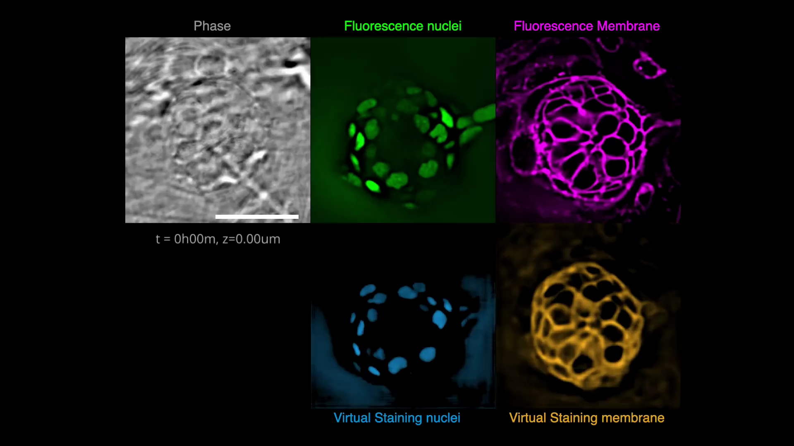

# VisCy

VisCy is a deep learning pipeline for training and deploying computer vision models for image-based phenotyping at single-cell resolution.

The following methods are being developed:

- Image translation
  - Robust virtual staining of landmark organelles
- Image classification
  - Supervised learning of of cell state (e.g. state of infection)
- Image representation learning
  - Self-supervised learning of the cell state and organelle phenotypes

VisCy is currently considered alpha software and is under active development.
Frequent breaking changes are expected.

## Virtual staining

A full illustration of the virtual staining pipeline can be found [here](docs/virtual_staining.md).
Below are some examples of virtually stained images (click to play videos).
See the full gallery [here](https://github.com/mehta-lab/VisCy/wiki/Gallery).

| VSCyto3D | VSNeuromast | VSCyto2D |
|:---:|:---:|:---:|
| [](https://github.com/mehta-lab/VisCy/assets/67518483/d53a81eb-eb37-44f3-b522-8bd7bddc7755) | [](https://github.com/mehta-lab/VisCy/assets/67518483/4cef8333-895c-486c-b260-167debb7fd64) | [](https://github.com/mehta-lab/VisCy/assets/67518483/287737dd-6b74-4ce3-8ee5-25fbf8be0018) |

### Reference

The virtual staining models and training protocols are reported in our recent [preprint on robust virtual staining](https://www.biorxiv.org/content/10.1101/2024.05.31.596901):

```bibtex
@article {Liu2024.05.31.596901,
    author = {Liu, Ziwen and Hirata-Miyasaki, Eduardo and Pradeep, Soorya and Rahm, Johanna and Foley, Christian and Chandler, Talon and Ivanov, Ivan and Woosley, Hunter and Lao, Tiger and Balasubramanian, Akilandeswari and Liu, Chad and Leonetti, Manu and Arias, Carolina and Jacobo, Adrian and Mehta, Shalin B.},
    title = {Robust virtual staining of landmark organelles},
    elocation-id = {2024.05.31.596901},
    year = {2024},
    doi = {10.1101/2024.05.31.596901},
    publisher = {Cold Spring Harbor Laboratory},
    URL = {https://www.biorxiv.org/content/early/2024/06/03/2024.05.31.596901},
    eprint = {https://www.biorxiv.org/content/early/2024/06/03/2024.05.31.596901.full.pdf},
    journal = {bioRxiv}
}
```

This package evolved from the [TensorFlow version of virtual staining pipeline](https://github.com/mehta-lab/microDL), which we reported in [this paper in 2020](https://elifesciences.org/articles/55502):

```bibtex
@article {10.7554/eLife.55502,
article_type = {journal},
title = {Revealing architectural order with quantitative label-free imaging and deep learning},
author = {Guo, Syuan-Ming and Yeh, Li-Hao and Folkesson, Jenny and Ivanov, Ivan E and Krishnan, Anitha P and Keefe, Matthew G and Hashemi, Ezzat and Shin, David and Chhun, Bryant B and Cho, Nathan H and Leonetti, Manuel D and Han, May H and Nowakowski, Tomasz J and Mehta, Shalin B},
editor = {Forstmann, Birte and Malhotra, Vivek and Van Valen, David},
volume = 9,
year = 2020,
month = {jul},
pub_date = {2020-07-27},
pages = {e55502},
citation = {eLife 2020;9:e55502},
doi = {10.7554/eLife.55502},
url = {https://doi.org/10.7554/eLife.55502},
keywords = {label-free imaging, inverse algorithms, deep learning, human tissue, polarization, phase},
journal = {eLife},
issn = {2050-084X},
publisher = {eLife Sciences Publications, Ltd},
}
```

## Installation

1. We recommend using a new Conda/virtual environment.

    ```sh
    conda create --name viscy python=3.10
    # OR specify a custom path since the dependencies are large:
    # conda create --prefix /path/to/conda/envs/viscy python=3.10
    ```

2. Install a released version of VisCy from PyPI:

    ```sh
    pip install viscy
    ```

    If evaluating virtually stained images for segmentation tasks,
    install additional dependencies:

    ```sh
    pip install "viscy[metrics]"
    ```

    Visualizing the model architecture requires `visual` dependencies:

    ```sh
    pip install "viscy[visual]"
    ```

3. Verify installation by accessing the CLI help message:

    ```sh
    viscy --help
    ```

For development installation, see [the contributing guide](CONTRIBUTING.md).

The pipeline is built using the [PyTorch Lightning](https://www.pytorchlightning.ai/index.html) framework.
The [iohub](https://github.com/czbiohub-sf/iohub) library is used
for reading and writing data in [OME-Zarr](https://www.nature.com/articles/s41592-021-01326-w) format.

The full functionality is tested on Linux `x86_64` with NVIDIA Ampere GPUs (CUDA 12.4).
Some features (e.g. mixed precision and distributed training) may not be available with other setups,
see [PyTorch documentation](https://pytorch.org) for details.
