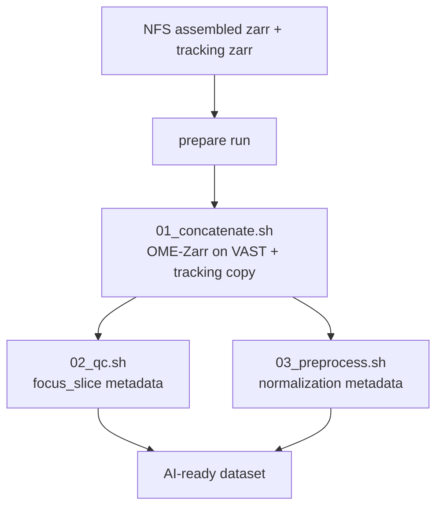

# Prepare an AI-ready dataset

This workflow copies an assembled dataset from NFS to VAST, rechunks it as
OME-Zarr, copies tracking data, and adds focus and normalization metadata.



`prepare run` executes `01_concatenate.sh`, waits for the internal biahub jobs,
then submits `02_qc.sh` and `03_preprocess.sh` in parallel.

## Required config

Start from
[`applications/airtable/configs/prepare_config.yml`](../../../airtable/configs/prepare_config.yml).

```yaml
nfs_root: /hpc/projects/intracellular_dashboard/organelle_dynamics
vast_root: /hpc/projects/organelle_phenotyping/datasets
workspace_dir: /hpc/mydata/eduardo.hirata/repos/viscy

concatenate:
  channel_names: null
  chunks_czyx: [1, 16, 256, 256]
  shards_ratio: [1, 1, 8, 8, 8]
  output_ome_zarr_version: "0.5"
  conda_env: biahub

qc:
  channel_names: [Phase3D]
  NA_det: 1.35
  lambda_ill: 0.450
  pixel_size: 0.1494
  device: cuda

preprocess:
  channel_names: -1
  num_workers: 32

slurm:
  qc:
    partition: gpu
    gres: gpu:1
    cpus_per_task: 16
    time: "00:30:00"
  preprocess:
    partition: cpu
    cpus_per_task: 32
    time: "04:00:00"
```

Set dataset-specific acquisition parameters under `qc`. Leave
`concatenate.channel_names: null` to discover Phase3D and raw channels.

## Run

Check the current state:

```sh
uv run --package airtable-utils prepare status <dataset> \
  -c applications/airtable/configs/prepare_config.yml
```

Generate configs and scripts without execution:

```sh
uv run --package airtable-utils prepare run <dataset> \
  -c applications/airtable/configs/prepare_config.yml \
  --dry-run
```

Run the complete preparation workflow:

```sh
uv run --package airtable-utils prepare run <dataset> \
  -c applications/airtable/configs/prepare_config.yml
```

Use `--force` only when an existing VAST zarr must be replaced.

## Outputs

```text
<vast_root>/<dataset>/
├── <dataset>.zarr
├── tracking.zarr
├── crop_concat.yml
├── qc_config.yml
├── 01_concatenate.sh
├── 02_qc.sh
└── 03_preprocess.sh
```

The dataset is ready when `prepare status` reports the expected OME-Zarr
version and both `focus_slice` and `normalization` metadata are present.

Continue with [training.md](training.md) to build a cell index, or
[inference_triplet.md](inference_triplet.md) to predict directly from the zarr
and tracking store.
