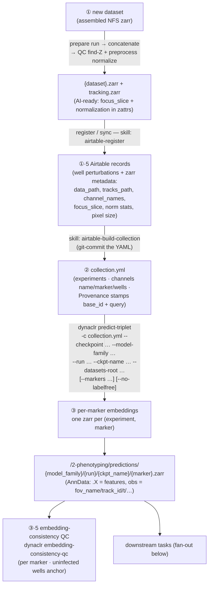
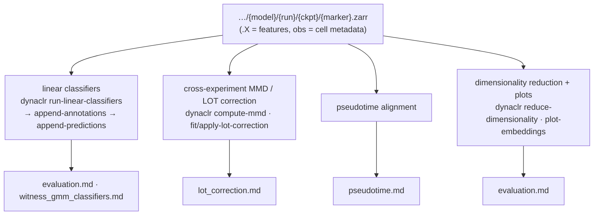
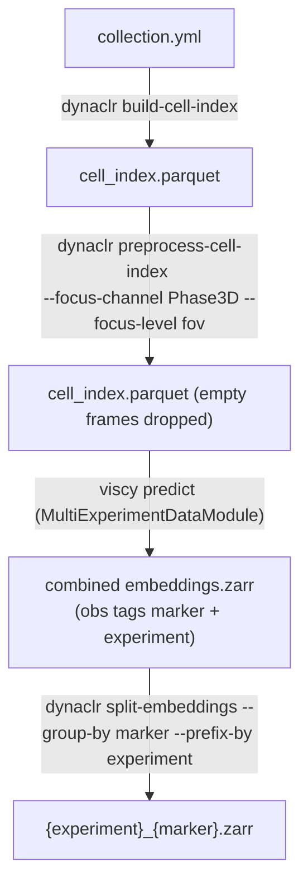

# End-to-End DAG (new dataset → prediction per-marker embeddings → downstream tasks)

## Summary:

This document details the methods to go from zarr datasets -> predictions ready for downstream tasks.

These are the two methods:

- **Primary spine:** the **Airtable →** `dynaclr predict-triplet` per-marker route — a
single command takes a git-tracked collection + a checkpoint and writes one embeddings
zarr per (experiment, marker) into a provenance-scoped tree. Use this to get a new
dataset to embeddings fast.
- **Alternate spine:** the **parquet-first** route (`build-cell-index` → `viscy predict`
→ `split-embeddings`) for large, reproducible multi-experiment runs — see
[evaluation.md](evaluation.md). It produces per-marker embeddings too (as
`{experiment}_{marker}.zarr` via `split-embeddings --prefix-by experiment`); the primary
spine writes them into the dataset-centric tree described below.

## Quickstart — new dataset → embeddings → eval

Run inference **once** per dataset (GPU), then evaluate the frozen embeddings **any number
of times** (CPU). Worked example: `2026_04_14_A549_SEC61B_DENV`.

**1. Build the collection** (Airtable → git-tracked recipe). One-time per dataset.

```bash
# skill: airtable-build-collection  → applications/dynaclr/configs/collections/<...>/<dataset>.yml
```

**2. Predict embeddings — all markers, into the dataset's own tree.** Once per dataset (or a
new checkpoint). `--datasets-root` selects the base; the dataset folder + `{marker}.zarr`
filename are derived automatically, so multiple markers co-locate.

```bash
dynaclr predict-triplet \
    -c applications/dynaclr/configs/collections/organelle-box-denv-zikv/2026_04_14_A549_SEC61B_DENV.yml \
    --checkpoint /hpc/projects/organelle_phenotyping/models/.../epoch=105-step=84800.ckpt \
    --model-family DynaCLR-2D-MIP-BagOfChannels \
    --run 2d-mip-fix-shuffler \
    --ckpt-name epoch105-step84800 \
    --datasets-root /hpc/projects/intracellular_dashboard/organelle_dynamics \
    --z-range 15 45 --z-reduction mip --reference-pixel-size 0.1494 \
    --num-workers 0            # [--markers SEC61B]  to subset; [--no-labelfree] to skip Phase3D
```

Writes (one per marker; dataset is in the path, so the filename is just `{marker}.zarr`):

```
<datasets-root>/<dataset>/2-phenotyping/predictions/{model_family}/{run}/{ckpt_name}/
    SEC61B.zarr   viral_sensor.zarr   Phase3D.zarr
```

**3. Evaluate the embeddings — one command over the cohort.** No GPU, no re-prediction.

```bash
uv run dynaclr eval \
    --eval-config applications/dynaclr/configs/evaluation/<config>.yaml \
    --model-family DynaCLR-2D-MIP-BagOfChannels \
    --run 2d-mip-fix-shuffler --ckpt-name epoch105-step84800 \
    [--datasets 2026_04_14_A549_SEC61B_DENV ...]   # omit = all datasets for this model/run/ckpt
```

This builds the `--embeddings_glob` and launches the Nextflow `eval_from_embeddings` entry
(reduce / smoothness / MMD / linear classifiers / append / plots). Equivalent direct call:

```bash
nextflow run applications/dynaclr/nextflow/main.nf -entry eval_from_embeddings \
    --eval_config <config>.yaml \
    --embeddings_glob '/hpc/projects/intracellular_dashboard/organelle_dynamics/*/2-phenotyping/predictions/DynaCLR-2D-MIP-BagOfChannels/2d-mip-fix-shuffler/epoch105-step84800/*.zarr' \
    -resume
```

**Progressive add:** a new dataset → step 2 for it → re-run step 3 with the same glob; the
cohort grows implicitly (the `*` in the dataset slot picks up the new one). Iterating a
classifier or adding a downstream task re-runs step 3 only — the embeddings are frozen.

See [inference_triplet.md](inference_triplet.md) for `predict-triplet` flag detail and
[../../nextflow/README.md](../../nextflow/README.md) for the two Nextflow entries.

## Primary spine — Airtable → per-marker inference




### Output:

```
<dataset>/2-phenotyping/predictions/{model_family}/{run}/{ckpt_name}/{marker}.zarr
```

## Downstream fan-out

Every downstream task consumes the per-marker `{marker}.zarr` embeddings. Each is an
independent, Nextflow-able unit that links to its owning DAG.




## Alternate spine — parquet-first (large reproducible runs)




The parquet path tags every row with `marker` (bag-of-channels explodes each cell into one
row per channel), so per-marker splitting is a single
`split-embeddings --group-by marker --prefix-by experiment`. See [evaluation.md](evaluation.md).

## Stage-by-stage


| #   | Stage                                     | Entry command                                                                                                                                         | Owning DAG                                                                                                     | Nextflow-able                   |
| --- | ----------------------------------------- | ----------------------------------------------------------------------------------------------------------------------------------------------------- | -------------------------------------------------------------------------------------------------------------- | ------------------------------- |
| ①   | **Preprocess** — find focus-Z + normalize | `prepare run <dataset> -c prepare_config.yaml` → `sbatch 02_qc.sh` + `sbatch 03_preprocess.sh`                                                        | [ai_ready_datasets.md](ai_ready_datasets.md)                                                                   | ❌ (batch tooling, not NF)       |
| ①·5 | **Register / sync Airtable**              | skill `airtable-register` (well records + zarr `.zattrs` metadata)                                                                                    | [inference_triplet.md](inference_triplet.md)                                                                   | ❌ human-in-the-loop             |
| ②   | **Build collection**                      | skill `airtable-build-collection` → `collection.yml` (git-committed)                                                                                  | [inference_triplet.md](inference_triplet.md)                                                                   | ❌ human-in-the-loop             |
| ③   | **Predict embeddings (per marker)**       | `dynaclr predict-triplet -c collection.yml --checkpoint … --model-family … --run … --ckpt-name … [--datasets-root …] [--markers …] [--no-labelfree]` | [inference_triplet.md](inference_triplet.md)                                                                   | ✅ one process per (exp, marker) |
| ③·5 | **Embedding-consistency QC**              | `dynaclr embedding-consistency-qc -c <config>.yml`                                                                                                    | `[embedding_consistency_qc.md](../../../../.ed_planning/dynaclr/batch_correction/embedding_consistency_qc.md)` | ✅                               |
| ④   | **Run linear classifiers**                | `dynaclr run-linear-classifiers -c clf.yml`                                                                                                           | [evaluation.md](evaluation.md), [witness_gmm_classifiers.md](witness_gmm_classifiers.md)                       | ✅                               |
| ⑤   | **Append predictions**                    | `dynaclr append-annotations -c …` → `dynaclr append-predictions -c …`                                                                                 | [evaluation.md](evaluation.md)                                                                                 | ✅                               |
| —   | **MMD / LOT correction**                  | `dynaclr compute-mmd` · `dynaclr fit-lot-correction` / `apply-lot-correction`                                                                         | [lot_correction.md](lot_correction.md)                                                                         | ✅                               |
| —   | **Pseudotime**                            | see owning DAG                                                                                                                                        | [pseudotime.md](pseudotime.md)                                                                                 | ✅                               |
| —   | **Dim-reduction + plots**                 | `dynaclr reduce-dimensionality` · `dynaclr plot-embeddings`                                                                                           | [evaluation.md](evaluation.md)                                                                                 | ✅                               |


## Alternate: parquet-first for stage ②

The alternate spine replaces stages ②–③ with the parquet path — `build-cell-index` (with
`--focus-level fov`) → `preprocess-cell-index` → `viscy predict` → `split-embeddings`. It's
the right choice for large multi-experiment reproducible runs; the collection YAML feeds
both routes. See [training.md](training.md) §build and
[../recipes/build-cell-index.md](../recipes/build-cell-index.md).

## Nextflow: inference and evaluation are two entries

Embeddings are written **once** into the dataset-centric tree (stage ③), then evaluation
reads those **frozen** embeddings — no GPU, no re-prediction — so classifiers and downstream
tasks (④/⑤ and the fan-out) can be re-run freely without re-embedding.

- **`-entry evaluation`** — full spine: predict → split → downstream. Use for the parquet
  spine or a one-shot run.
- **`-entry eval_from_embeddings`** — skips predict/split; sources per-experiment zarrs from
  `--embeddings_glob` and runs the same shared `DOWNSTREAM` DAG. The glob is the **cohort
  selector** (`*` in the dataset slot); the eval config says *what to compute*. Add a dataset →
  predict it → re-run the same glob; the cohort grows implicitly.

One-command launcher: `dynaclr eval` turns a `(model_family, run, ckpt_name)` identity into
the glob and launches the `eval_from_embeddings` entry. See
[../../nextflow/README.md](../../nextflow/README.md) for both entries and the run-once /
eval-many pattern.
