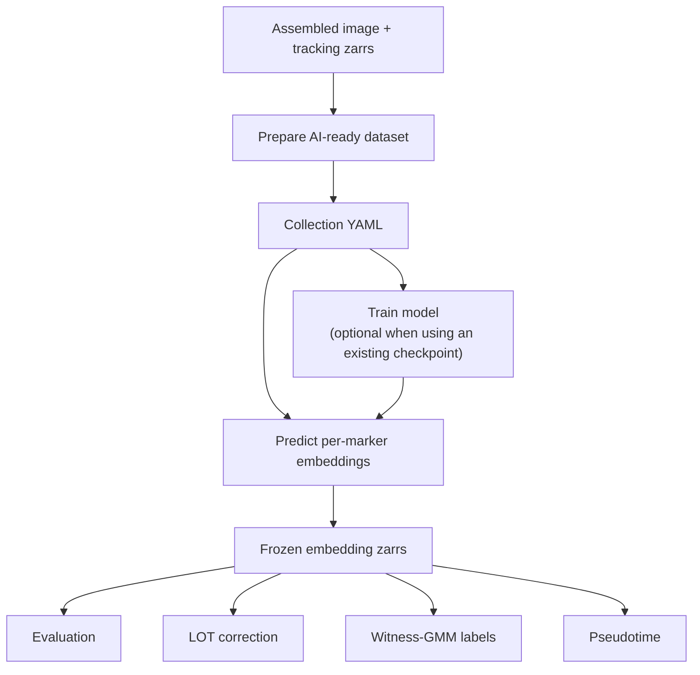

# DynaCLR workflow overview

This page is the entry point from an assembled dataset to reusable embeddings
and downstream evaluation.



## 1. Prepare the dataset

```sh
uv run --package airtable-utils prepare run <dataset> \
  -c applications/airtable/configs/prepare_config.yml
```

This produces an OME-Zarr and tracking store with focus and normalization
metadata. See [ai_ready_datasets.md](ai_ready_datasets.md).

## 2. Create the collection

Create or update a collection under:

```text
applications/dynaclr/configs/collections/
```

The collection is the shared input for cell-index construction and
`predict-triplet`. It must define each experiment's image store, tracking store,
channels, marker names, and well selection.

## 3. Train or select a checkpoint

To train a model:

```sh
uv run dynaclr fit \
  -c applications/dynaclr/configs/training/<model>.yml
```

See [training.md](training.md). Skip this stage when a compatible checkpoint
already exists.

## 4. Predict embeddings

```sh
uv run dynaclr predict-triplet \
  -c applications/dynaclr/configs/collections/<collection>.yml \
  --checkpoint /path/to/checkpoint.ckpt \
  --model-family <model-family> \
  --run <run-name> \
  --ckpt-name <checkpoint-name> \
  --datasets-root /hpc/projects/intracellular_dashboard/organelle_dynamics \
  --z-range 15 45 \
  --z-reduction mip \
  --reference-pixel-size 0.1494 \
  --num-workers 0
```

The command writes one zarr per experiment and marker:

```text
<datasets-root>/<dataset>/2-phenotyping/predictions/
  <model-family>/<run-name>/<checkpoint-name>/<marker>.zarr
```

See [inference_triplet.md](inference_triplet.md) for input requirements and
optional flags.

## 5. Evaluate frozen embeddings

Use the launcher when embeddings already exist:

```sh
uv run dynaclr eval \
  --eval-config applications/dynaclr/configs/evaluation/<config>.yaml \
  --model-family <model-family> \
  --run <run-name> \
  --ckpt-name <checkpoint-name>
```

This launches the Nextflow `eval_from_embeddings` workflow. Reusing frozen
embeddings keeps prediction separate from downstream iteration. See
[evaluation.md](evaluation.md).

## Downstream workflows

| Workflow | Command | Documentation |
| --- | --- | --- |
| Batch evaluation | `dynaclr eval` or Nextflow `evaluation` | [evaluation.md](evaluation.md) |
| Evaluation matrix | `dynaclr run-matrix` | [evaluation_matrix.md](evaluation_matrix.md) |
| LOT correction | `dynaclr fit-lot-correction` / `apply-lot-correction` | [lot_correction.md](lot_correction.md) |
| Witness pseudo-labels | `dynaclr witness-gmm-labels` | [witness_gmm_classifiers.md](witness_gmm_classifiers.md) |
| Pseudotime scripts | staged Python CLIs | [pseudotime.md](pseudotime.md) |

Use one stable tuple—`model-family`, `run`, and `checkpoint-name`—for the
prediction directory and every downstream invocation.
