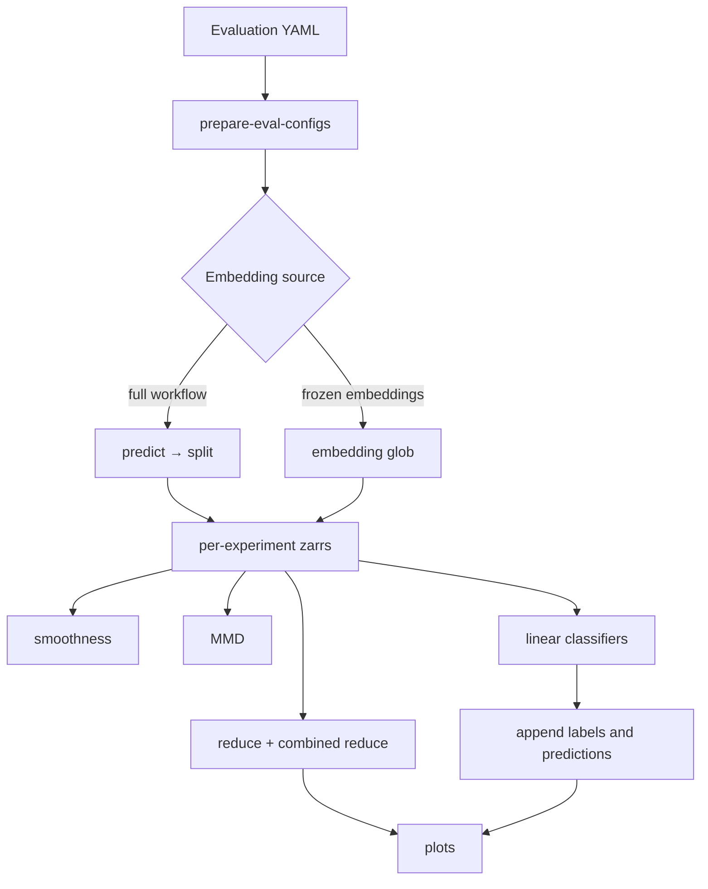

# Evaluate DynaCLR embeddings

The evaluation workflow predicts or loads embeddings, then fans out
dimensionality reduction, plots, smoothness, MMD, and linear-classifier tasks.
Nextflow is the recommended runner.



## Choose an entry point

Use `evaluation` when prediction must run from a checkpoint and cell-index
parquet:

```sh
module load nextflow/24.10.5

nextflow run applications/dynaclr/nextflow/main.nf \
  -entry evaluation \
  --eval_config applications/dynaclr/configs/evaluation/<config>.yaml \
  --workspace_dir /hpc/mydata/eduardo.hirata/repos/viscy \
  -resume
```

Use `dynaclr eval` when per-marker embeddings already exist in the standard
prediction tree:

```sh
uv run dynaclr eval \
  --eval-config applications/dynaclr/configs/evaluation/<config>.yaml \
  --model-family <model-family> \
  --run <run-name> \
  --ckpt-name <checkpoint-name>
```

Optional launcher filters:

```sh
--marker SEC61B
--datasets <dataset-a> --datasets <dataset-b>
--print-cmd
```

The equivalent direct frozen-embedding entry is:

```sh
nextflow run applications/dynaclr/nextflow/main.nf \
  -entry eval_from_embeddings \
  --eval_config applications/dynaclr/configs/evaluation/<config>.yaml \
  --embeddings_glob '<datasets-root>/*/2-phenotyping/predictions/<model>/<run>/<ckpt>/*.zarr' \
  --workspace_dir /hpc/mydata/eduardo.hirata/repos/viscy \
  -resume
```

Add `-profile local` for a local smoke test. Keep `-resume` for recoverable and
incremental runs.

## Evaluation config

Create model-specific leaves under
[`applications/dynaclr/configs/evaluation/`](../../configs/evaluation/) and
compose shared settings from `recipes/`.

```yaml
base:
  - ../recipes/predict.yml
  - ../recipes/reduce.yml
  - ../recipes/plot_infectomics.yml
  - ../recipes/infectomics-annotated.yml

training_config: /path/to/resolved-training-config.yaml
ckpt_path: /path/to/checkpoint.ckpt
cell_index_path: /path/to/cell-index.parquet
output_dir: /path/to/evaluation-output

steps:
  - predict
  - split
  - reduce_dimensionality
  - reduce_combined
  - smoothness
  - mmd
  - linear_classifiers
  - append_annotations
  - append_predictions
  - plot
  - plot_combined
```

Only list the steps required by the run. For frozen embeddings, `predict` and
`split` are not executed by `eval_from_embeddings`, even if inherited from a
shared recipe.

Generate and inspect the resolved step configs without launching Nextflow:

```sh
uv run dynaclr prepare-eval-configs \
  -c applications/dynaclr/configs/evaluation/<config>.yaml
```

Generated YAMLs and the copied input config are written under
`<output_dir>/configs/`.

## MMD block

Each item under `mmd` becomes one per-experiment analysis and, when
`combined_mode: true`, one cross-experiment analysis.

```yaml
mmd:
  - name: perturbation
    group_by: perturbation
    comparisons:
      - cond_a: control
        cond_b: perturbed
        label: control_vs_perturbed
    temporal_bin_size: 4.0
    combined_temporal_bin_size: null
    combined_mode: true
    embedding_key: null
    mmd:
      n_permutations: 1000
      max_cells: 5000
```

For standalone runs, use a generated MMD YAML:

```sh
uv run dynaclr compute-mmd -c mmd.yaml
uv run dynaclr compute-mmd --combined -c mmd_cross_exp.yaml
uv run dynaclr compute-mmd --pooled -c mmd_pooled.yaml
```

## Linear classifiers

Classifier tasks use annotation files keyed to cells. Use a group-aware split
when tracks contribute multiple frames.

```yaml
linear_classifiers:
  label_source: annotations
  annotations:
    - experiment: <experiment-name>
      path: /path/to/annotations.csv
  tasks:
    - task: infection_state
      marker_filters: [Phase3D]
  use_scaling: true
  use_pca: false
  split_train_data: 0.8
  split_groups_by: [experiment, fov_name, track_id]
  random_seed: 42
```

The workflow trains one pipeline per task-marker pair. Witness-GMM labels use
the same annotation path; see
[witness_gmm_classifiers.md](witness_gmm_classifiers.md).

To publish a fitted bundle for later runs:

```yaml
linear_classifiers:
  publish_dir: /path/to/linear_classifiers/<feature-space>
```

To apply a published bundle without retraining:

```yaml
append_predictions:
  pipelines_dir: /path/to/linear_classifiers/<feature-space>/v2
```

Pin a version directory for reproducible runs. Use `latest` only for active
iteration. A classifier bundle must be applied to the same embedding feature
space in which it was trained.

## Outputs

Depending on `steps`, the workflow writes:

```text
<output_dir>/
├── configs/
├── embeddings/<experiment>.zarr
├── plots/
├── smoothness/
├── mmd/<block>/
├── mmd/<block>_cross_exp/
└── linear_classifiers/
    ├── metrics_summary.csv
    ├── <task>_summary.pdf
    └── pipelines/
        ├── manifest.json
        └── <task>_<marker>.joblib
```

Enrichment steps update each embedding zarr with:

- annotation and predicted-label columns in `.obs`;
- prediction probabilities in `.obsm`;
- class order and classifier lineage in `.uns`;
- per-experiment and combined reductions in `.obsm`.

## Direct step commands

Nextflow normally patches generated configs and calls these commands:

| Step | Command |
| --- | --- |
| Split combined embeddings | `dynaclr split-embeddings --input <zarr> --output-dir <dir>` |
| Per-store reduction | `dynaclr reduce-dimensionality -c <config>` |
| Combined reduction | `dynaclr combined-dim-reduction -c <config>` |
| Plot embeddings | `dynaclr plot-embeddings -c <config>` |
| Smoothness | `dynaclr evaluate-smoothness -c <config>` |
| MMD | `dynaclr compute-mmd -c <config>` |
| Linear probes | `dynaclr run-linear-classifiers -c <config>` |
| Append labels | `dynaclr append-annotations -c <config>` |
| Append predictions | `dynaclr append-predictions -c <config>` |

Use the generated configs rather than recreating their placeholder substitution
manually.

## Validation

- Confirm every requested experiment appears under `embeddings/`.
- Confirm all requested `steps` produced non-empty outputs.
- Inspect failed or skipped classifier tasks for missing labels or marker
  mismatches.
- Check MMD group counts before interpreting scores.
- Rerun the same Nextflow command with `-resume` after correcting a failed step.

For multi-row submission, see
[evaluation_matrix.md](evaluation_matrix.md). For the workflow implementation,
see [the Nextflow README](../../nextflow/README.md).
