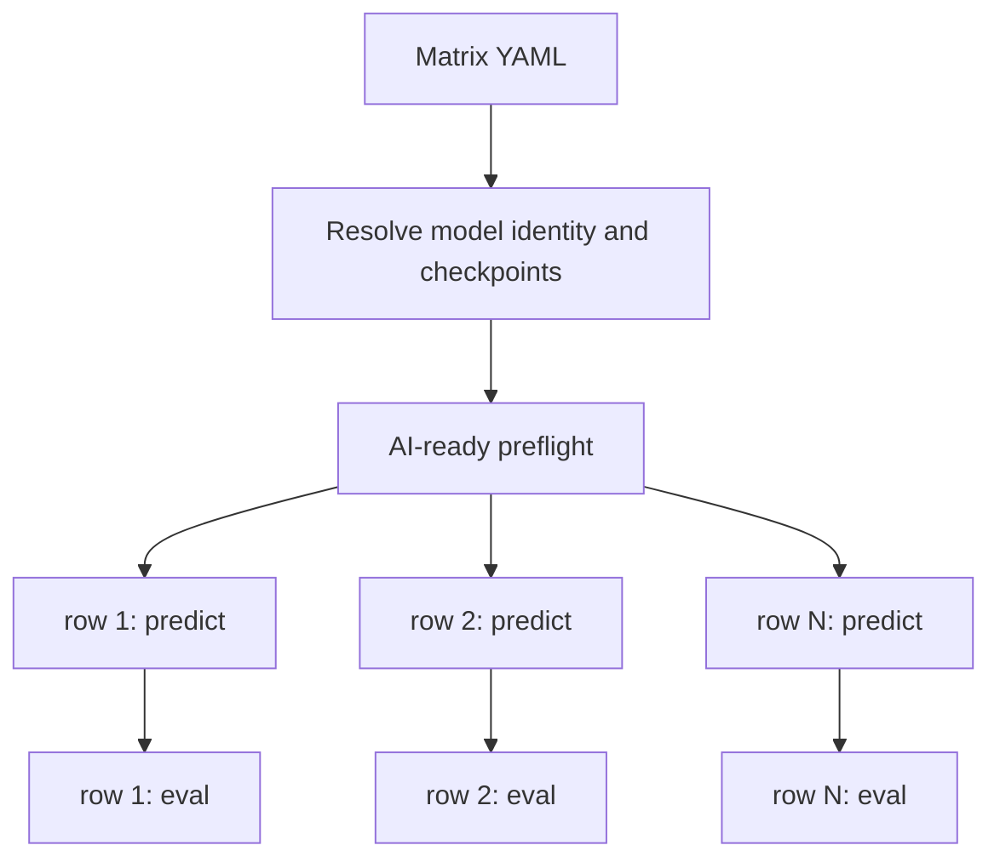

# Run a prediction and evaluation matrix

`dynaclr run-matrix` submits prediction and evaluation jobs for multiple
collections, models, or checkpoints. Models must already be trained; the
matrix runner does not submit training jobs.



Rows run in parallel. Within each row and checkpoint, evaluation is submitted
with an `afterok` dependency on prediction.

## Matrix config

Start from
[`applications/dynaclr/configs/matrix/example.yml`](../../configs/matrix/example.yml).

```yaml
defaults:
  train_sbatch: applications/dynaclr/configs/training/DynaCLR-2D/<model>.sh
  ckpt_name: epoch105-step84800
  checkpoint: /path/to/epoch=105-step=84800.ckpt
  eval_config: applications/dynaclr/configs/evaluation/<config>.yaml
  datasets_root: /hpc/projects/intracellular_dashboard/organelle_dynamics

models:
  - collection: applications/dynaclr/configs/collections/<dataset-a>.yml
    markers: [SEC61B, Phase3D]
  - collection: applications/dynaclr/configs/collections/<dataset-b>.yml
    markers: [G3BP1, Phase3D]
```

`train_sbatch` is used only to parse the model `family`, `run`, and training
config identity from its exported variables. It is not submitted. Set
`checkpoint` explicitly when the checkpoint is nested below a logger run
directory.

To sweep checkpoints in one row:

```yaml
models:
  - train_sbatch: applications/dynaclr/configs/training/DynaCLR-2D/<model>.sh
    collection: applications/dynaclr/configs/collections/<dataset>.yml
    ckpt_names: [epoch80-step64000, epoch105-step84800]
    checkpoints:
      - /path/to/epoch=80-step=64000.ckpt
      - /path/to/epoch=105-step=84800.ckpt
```

`ckpt_names` and `checkpoints` must have the same length. Each pair creates an
independent `predict → eval` chain.

Prediction parameters not represented in the matrix schema are controlled by
[`applications/dynaclr/tools/predict.sbatch`](../../tools/predict.sbatch).
Legacy `predict_flags` blocks in existing matrix examples are not currently
consumed by `run-matrix`; do not rely on them.

## Run

Always inspect the submission plan first:

```sh
uv run dynaclr run-matrix \
  -c applications/dynaclr/configs/matrix/<matrix>.yml \
  --dry-run
```

Submit prediction and evaluation:

```sh
uv run dynaclr run-matrix \
  -c applications/dynaclr/configs/matrix/<matrix>.yml \
  --stages predict,eval
```

Run only one stage when needed:

```sh
uv run dynaclr run-matrix -c <matrix>.yml --stages predict
uv run dynaclr run-matrix -c <matrix>.yml --stages eval
```

On real prediction submissions, the runner verifies that every collection has
focus and normalization metadata before queueing jobs. `--skip-preflight`
bypasses this check and should only be used when readiness was verified
separately.

## Adding datasets to one model

Rows with the same model, run, and checkpoint write into the same embedding
tree. Their evaluation jobs do not wait for prediction jobs from sibling rows.
For this case, predict the full matrix first:

```sh
uv run dynaclr run-matrix \
  -c applications/dynaclr/configs/matrix/<matrix>.yml \
  --stages predict
```

After all prediction jobs finish, launch one cohort evaluation:

```sh
uv run dynaclr eval \
  --eval-config applications/dynaclr/configs/evaluation/<config>.yaml \
  --model-family <model-family> \
  --run <run-name> \
  --ckpt-name <checkpoint-name>
```

This avoids multiple evaluations writing to the same `output_dir`.

## Outputs

Prediction uses the standard provenance tree:

```text
<datasets-root>/<dataset>/2-phenotyping/predictions/
  <model-family>/<run>/<checkpoint>/<marker>.zarr
```

Evaluation writes to the `output_dir` declared by each evaluation config. See
[evaluation.md](evaluation.md) for the output layout.

## Validation

- Inspect `--dry-run` output for the resolved collection, checkpoint, model
  family, run, marker list, and evaluation config.
- Confirm every prediction job completed before launching a gathered cohort
  evaluation.
- Give concurrent evaluation rows distinct `output_dir` values.
- Use pinned checkpoints and classifier bundle versions for reproducible
  matrices.

The maintained multi-dataset example is
[`organelle_remodeling.yml`](../../configs/matrix/organelle_remodeling.yml).
