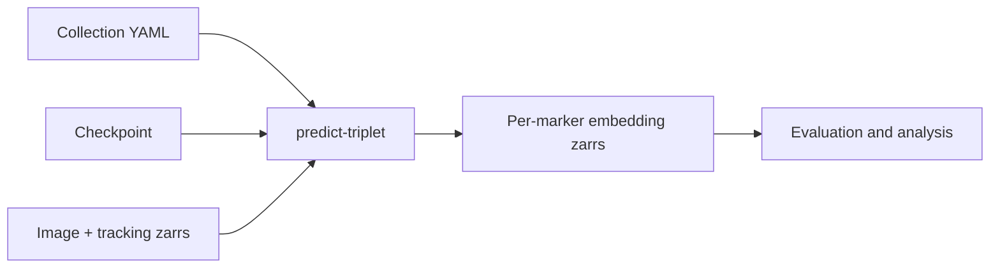

# Predict per-marker embeddings

`dynaclr predict-triplet` runs a trained checkpoint directly against image and
tracking zarrs defined by a collection. It writes one AnnData zarr per
experiment and marker.



Use this workflow for collection-driven inference. The parquet-first prediction
path used by the full evaluation workflow is documented in
[evaluation.md](evaluation.md).

## Inputs

- An AI-ready image zarr with normalization metadata.
- A tracking zarr with `track_id`, `t`, `y`, and `x`.
- A checkpoint compatible with the configured model family.
- A collection YAML under
  [`applications/dynaclr/configs/collections/`](../../configs/collections/).

For each experiment, the collection must provide the data paths and channel to
marker mapping. Optional `wells` restricts a channel entry to part of a plate.

```yaml
name: <collection-name>
experiments:
  - name: <experiment-name>
    data_path: /path/to/dataset.zarr
    tracks_path: /path/to/tracking.zarr
    channels:
      - name: Phase3D
        marker: Phase3D
      - name: raw GFP EX488 EM525-45
        marker: SEC61B
        wells: [A/2, B/2]
    perturbation_wells:
      control: [A/1, B/1]
      perturbed: [A/2, B/2]
    interval_minutes: 30.0
    pixel_size_xy_um: 0.1494
    pixel_size_z_um: 0.174
```

## Run

```sh
uv run dynaclr predict-triplet \
  -c applications/dynaclr/configs/collections/<collection>.yml \
  --checkpoint /path/to/checkpoint.ckpt \
  --model-family <model-family> \
  --run <run-name> \
  --ckpt-name <checkpoint-name> \
  --datasets-root /hpc/projects/intracellular_dashboard/organelle_dynamics \
  --z-window 10 \
  --focus-channel Phase3D \
  --z-focus-offset 0.3 \
  --z-reduction mip \
  --reference-pixel-size 0.1494 \
  --reference-pixel-size-z-um 0.174 \
  --yx-patch-size 160 160 \
  --batch-size 32 \
  --num-workers 0
```

Important options:

| Option | Purpose |
| --- | --- |
| `--markers SEC61B,TOMM20` | Predict only the listed markers. |
| `--no-labelfree` | Skip phase and brightfield channels. |
| `--z-window` | Focus-centered window width in reference-grid slices. |
| `--z-reduction mip|center` | Collapse the selected z window for a 2D model. |
| `--reference-pixel-size` | Rescale crops to the model's training pixel size. |
| `--reference-pixel-size-z-um` | Convert `--z-window` to the native slice count covering the same physical depth. |
| `--no-enrich-obs` | Do not append collection metadata to output `obs`. |

For example, `--z-window 10 --reference-pixel-size-z-um 0.174`
defines a 1.74 µm slab. A dataset sampled at 0.288 µm/slice reads 6 native
slices rather than 10, then resizes those 6 slices back to the 10-slice
reference grid with nearest-neighbor interpolation before augmentation and
MIP. The native count is rounded to the nearest whole slice. Triplet and
MultiExperiment use this same sequence.
Physical Z normalization requires the focus-centered `--z-window` form;
absolute `--z-range` indices retain their literal native-slice meaning.

Keep `--num-workers 0`; multiprocessing can deadlock while reading zarr during
prediction. Prediction is deterministic and does not apply training
augmentations.

## Outputs

```text
<datasets-root>/<dataset>/2-phenotyping/predictions/
└── <model-family>/
    └── <run-name>/
        └── <checkpoint-name>/
            ├── Phase3D.zarr
            ├── SEC61B.zarr
            └── <marker>.zarr
```

Each output is an AnnData store:

- `.X`: selected embedding representation;
- `.obs`: cell identifiers, tracking fields, and collection metadata;
- `.uns`: model, run, checkpoint, collection, marker, and channel provenance.

The output path is derived from the collection and provenance flags. Use the
same `model-family`, `run`, and `checkpoint-name` in downstream launchers.

## Batch prediction

For multiple collections or checkpoints, use the matrix runner instead of
writing per-dataset shell loops:

```sh
uv run dynaclr run-matrix \
  -c applications/dynaclr/configs/matrix/<matrix>.yml \
  --stages predict \
  --dry-run
```

Inspect the dry run, then rerun without `--dry-run`. See
[evaluation_matrix.md](evaluation_matrix.md).

## Validation

- Confirm one zarr was written for every requested experiment-marker pair.
- Run `uv run dynaclr info <marker>.zarr` and verify row count, feature count,
  `obs` metadata, and provenance.
- Treat embeddings from different checkpoints as different feature spaces.

Continue with [evaluation.md](evaluation.md) to evaluate the frozen outputs.
