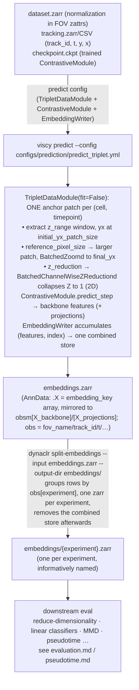
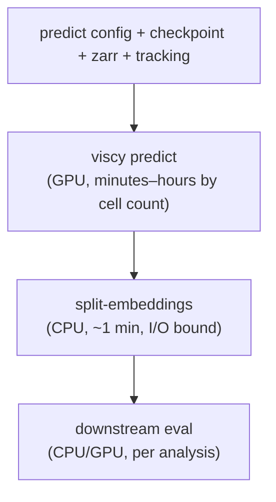

# Inference DAG (Triplet path)

Embedding inference for a trained DynaCLR encoder using `TripletDataModule` —
the **zarr + tracking** path (no parquet). Use this when you want to run a
trained checkpoint directly over an OME-Zarr store and its `ultrack` tracking,
rather than the parquet-first `MultiExperimentDataModule` path
(see [evaluation.md](evaluation.md) for the parquet path).

The triplet path is the one that carries the patch-rescaling
(`reference_pixel_size`) and on-the-fly Z-reduction (`z_reduction`) options, so
a 3D zarr can feed a 2D model without materializing a separate MIP dataset.

## Prerequisites

- A trained checkpoint (`last.ckpt` or a selected epoch) for a
  `dynaclr.engine.ContrastiveModule`.
- The inference dataset as an OME-Zarr store with `normalization` metadata in
  the FOV `zattrs` (so `NormalizeSampled` has per-FOV stats), plus a tracking
  zarr/CSV directory with `track_id, t, y, x` columns.
- The model's training pixel size (µm/px) if the inference dataset was acquired
  at a different magnification — passed as `reference_pixel_size` to rescale
  each patch to the physical area the model was trained on.

## Step-by-step detail



## Pipeline DAG (process dependency)



## Key commands

| Step             | Command                                                                     | Input                                   | Output                              |
| ---------------- | --------------------------------------------------------------------------- | --------------------------------------- | ----------------------------------- |
| Predict          | `uv run viscy predict --config configs/prediction/predict_triplet.yml`      | predict config + ckpt + zarr + tracking | combined `embeddings.zarr`          |
| Predict (SLURM)  | `sbatch configs/prediction/predict_triplet.sh`                              | same                                    | combined `embeddings.zarr`          |
| Split embeddings | `dynaclr split-embeddings --input embeddings.zarr --output-dir embeddings/ [--group-by experiment]` | combined zarr with the `--group-by` column in `obs`  | one `{group}.zarr` per group value |

## What lives where

| Data                              | Location                                          | When written          |
| --------------------------------- | ------------------------------------------------- | --------------------- |
| Pixel data (TCZYX)                | dataset.zarr on VAST                               | data prep             |
| Cell tracks (track_id, t, y, x)   | tracking.zarr / CSV on VAST                        | data prep             |
| Normalization stats (per FOV)     | dataset.zarr FOV `zattrs["normalization"]`         | `viscy preprocess`    |
| Backbone embeddings               | `embeddings.zarr` → `.X` (+ `obsm["X_backbone"]`)  | `viscy predict`       |
| Cell index (fov_name/track_id/t)  | `embeddings.zarr` → `obs`                          | `viscy predict`       |
| Per-experiment embeddings         | `embeddings/{experiment}.zarr`                     | `split-embeddings`    |

## Predict config structure

A ready-to-edit sample lives at
[`configs/prediction/predict_triplet_2d_from_3d.yml`](../../configs/prediction/predict_triplet_2d_from_3d.yml)
(the 2D-from-3D case, with `z_reduction` + `reference_pixel_size`). The skeleton
below annotates the load-bearing fields:

```yaml
seed_everything: 42

trainer:
  accelerator: gpu
  devices: 1
  precision: 32-true
  inference_mode: true
  logger: false
  callbacks:
    - class_path: viscy_utils.callbacks.embedding_writer.EmbeddingWriter
      init_args:
        output_path: /path/to/embeddings/embeddings.zarr
        embedding_key: features        # "projections" for frozen-backbone MLP heads
        overwrite: true

model:
  class_path: dynaclr.engine.ContrastiveModule
  init_args:
    encoder:
      class_path: viscy_models.contrastive.ContrastiveEncoder
      init_args:
        backbone: convnext_tiny
        in_channels: 1
        in_stack_depth: 1              # 2D model — pair with z_reduction below
        # … must match the trained checkpoint's encoder args …

data:
  class_path: viscy_data.TripletDataModule
  init_args:
    data_path: /path/to/dataset.zarr
    tracks_path: /path/to/tracking.zarr
    source_channel: [Phase3D]
    z_range: [0, 16]                   # window collapsed by z_reduction
    final_yx_patch_size: [160, 160]
    reference_pixel_size: 0.1494       # rescale to the model's training pixel size (optional)
    z_reduction: mip                   # collapse z_range to 1 slice for a 2D model (optional)
    batch_size: 400
    num_workers: 0                     # REQUIRED for predict (see Notes)
    predict_cells: false               # true + include_fov_names/include_track_ids to subset
    normalizations:
      - class_path: viscy_transforms.NormalizeSampled
        init_args:
          keys: [Phase3D]
          subtrahend: mean
          divisor: std
    augmentations: []                  # MUST be empty for deterministic predict

ckpt_path: /path/to/checkpoint/last.ckpt
return_predictions: false              # writer persists to zarr; don't hold in memory
```

## Notes

- **`num_workers: 0` is required for the predict path.** `HCSDataModule`/
  `TripletDataModule` predict does not use `mmap_preload`, and >0 workers risks a
  zarr-fork deadlock. This matches the dynacell predict overlay.
- **`augmentations: []`** — predict must be deterministic. The datamodule still
  applies `normalizations` (and the `reference_pixel_size` rescale + `z_reduction`
  collapse) at predict time via `_no_augmentation_transform`; only random
  augmentations are dropped.
- **2D from 3D without a MIP dataset.** Set `z_reduction: mip` (or `center`) to
  collapse the extracted `z_range` window to a single slice. Label-free channels
  (resolved by name via `parse_channel_name`) take the center slice; all other
  channels are max-projected. Pair with `in_stack_depth: 1` on the encoder.
  Center the `z_range` on the focus plane to control which planes are collapsed.
- **Pixel-size rescaling.** When the inference dataset's pixel size differs from
  the model's training pixel size, set `reference_pixel_size` (µm/px) so a larger
  patch covering the same physical area is extracted and bilinearly resized to
  `final_yx_patch_size`. Leave unset for same-resolution datasets.
- **`embedding_key`.** Use `features` for the backbone output (most models) and
  `projections` for frozen-backbone MLP-head models, which writes
  `obsm["X_projections"]` instead.
- **`split-embeddings` groups by any `obs` column via `--group-by`** (default
  `experiment`) and can prefix filenames via `--prefix-by` (e.g.
  `--group-by marker --prefix-by experiment` → `{experiment}_{marker}.zarr`). The
  requested columns must exist on the combined store. For a single-experiment
  predict run the default split is optional — the combined `embeddings.zarr` is
  already per-experiment.
- **The triplet `EmbeddingWriter` writes only ultrack index columns** to `obs`
  (`fov_name, track_id, t, id, parent_track_id, parent_id, z, y, x`). It does
  **not** write `experiment` or `marker` — those come from the parquet path
  (`MultiExperimentDataModule`), which carries collection metadata. Therefore
  `split-embeddings --group-by marker` cannot split triplet output; see below for
  the per-marker recipe.
- Downstream analyses (dimensionality reduction, linear classifiers, MMD,
  pseudotime) consume the per-experiment zarrs and are documented in
  [evaluation.md](evaluation.md) and [pseudotime.md](pseudotime.md).

## Per-marker embeddings (bag-of-channels models) — `dynaclr predict-triplet`

Bag-of-channels models (e.g. `DynaCLR-2D-MIP-BagOfChannels`) are trained with
`in_channels: 1` — each marker is embedded as its own single-channel sample. On
the triplet path there is no combined store to split by marker (the writer omits
`marker`, see Notes), so the per-marker split is expressed by **running predict
once per marker**, each with a single `source_channel`.

This is a **single command** — no hand-written per-dataset config generator:

```sh
dynaclr predict-triplet \
    -c collection.yml \
    --checkpoint /path/to/epoch=105-step=84800.ckpt \
    --model-family DynaCLR-2D-MIP-BagOfChannels \
    --run 2d-mip-...-fix-shuffler \
    --ckpt-name epoch105-step84800 \
    --datasets-root /hpc/projects/intracellular_dashboard/organelle_dynamics \
    --z-range 15 45 --z-reduction mip --reference-pixel-size 0.1494 \
    [--markers SEC61B,TOMM20] [--no-labelfree]
```

The **collection YAML is the single source of truth**. Each `ChannelEntry`
carries a zarr `name`, a `marker` label, and optional `wells` (empty = all
wells). The command runs predict once per channel entry, restricting to that
channel's `wells` via `fit_include_wells`, and writes one zarr per marker. When a
reporter varies by plate column (multi-organelle "box" plates), list the same
zarr channel once per organelle with its own `wells`:

```yaml
experiments:
  - name: 2026_07_01_A549_SEC61B_TOMM20_G3BP1_ZIKV
    channels:
      - {name: raw GFP EX488 EM525-45, marker: SEC61B, wells: [A/2, B/2]}
      - {name: raw GFP EX488 EM525-45, marker: TOMM20, wells: [A/3, B/3]}
      - {name: raw GFP EX488 EM525-45, marker: G3BP1, wells: [A/4, B/4]}
      - {name: raw mCherry EX561 EM600-37, marker: pAL17}   # all wells
```

**Dataset- and provenance-scoped output tree** — so every zarr traces back to
what produced it and two models/checkpoints can coexist for comparison:

```
{datasets_root}/{dataset}/2-phenotyping/predictions/{model_family}/{run}/{ckpt_name}/{marker}.zarr
```

The dataset is derived from each experiment's `data_path`; the directory tree is
the artifact index, so downstream consumers pool matching stores with a glob and
no registry file is required.

`--markers` selects a subset; `--no-labelfree` skips phase/brightfield channels
(resolved by name via `parse_channel_name`).

> **Legacy (retired):** older datasets used a per-dataset
> `generate_predict_configs.py` + `predict_triplet_per_marker.sh` copied into
> `2-phenotyping/predictions/configs/` (e.g. the DENV worked example). That
> pattern fragmented — everyone copied and forked it. Prefer `predict-triplet`;
> the generator is kept only for already-run datasets.

### Provenance & Nextflow

`predict-triplet` writes the model/run/checkpoint-scoped tree directly. The
parquet path can route its combined store into the same tree with
`split-embeddings --route-by-dataset --model-family M --run R --ckpt-name C`.
Evaluation is decoupled from prediction: `dynaclr eval` builds the cohort glob
and launches the Nextflow `eval_from_embeddings` entry over the frozen stores.
For batch prediction or a full train→predict→eval sweep, use `dynaclr
predict-batch` or `dynaclr run-matrix`.

For the **parquet path**, one predict run already tags every row with `marker`
(bag-of-channels explodes each cell into one row per channel), so per-marker
splitting is instead a single
`dynaclr split-embeddings --group-by marker --prefix-by experiment`, which writes
`{experiment}_{marker}.zarr` for the same convention.

## Triplet vs parquet (MultiExperimentDataModule)

| Aspect              | Triplet path (this doc)                          | Parquet path (evaluation.md)                       |
| ------------------- | ------------------------------------------------ | -------------------------------------------------- |
| Aspect              | Triplet path (this doc)                                           | Parquet path (evaluation.md)                       |
| ------------------- | ------------------------------------------------------------------ | -------------------------------------------------- |
| Data entry point    | `data_path` zarr + `tracks_path`                                   | `cell_index.parquet` (built + preprocessed)        |
| Setup cost          | reads tracking + zarr shape at init                                | reads parquet only at init                         |
| Focus / z window    | explicit `z_range` or per-FOV `z_extraction_window` from `focus_slice`; `z_reduction` collapses | per-FOV `z_extraction_window` from `focus_slice`   |
| Pixel rescaling     | `reference_pixel_size`                           | `reference_pixel_size_xy_um`                       |
| Best for            | ad-hoc predict over a single zarr + tracking     | large multi-experiment runs, reproducible recipes  |
