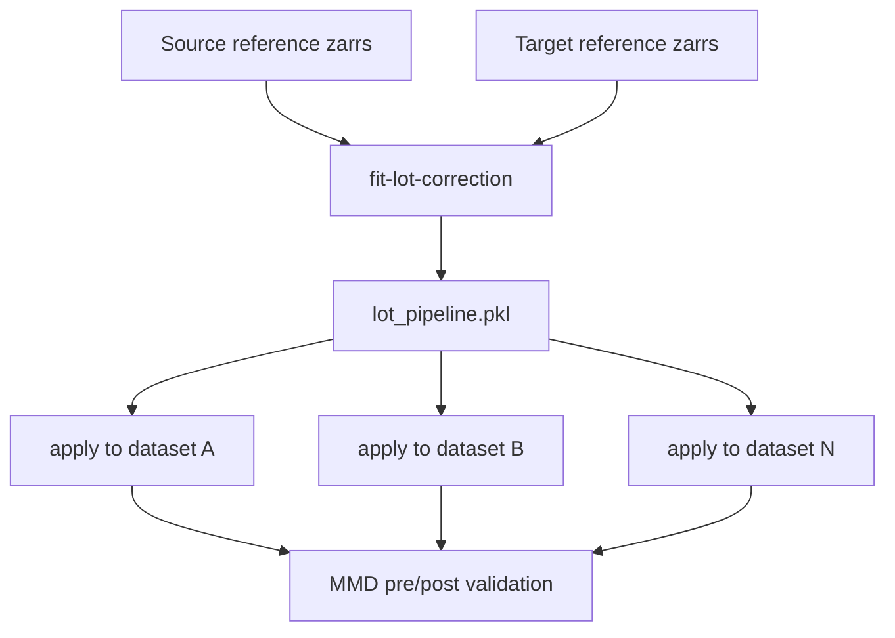

# Correct embedding batches with LOT

Fit one Linear Optimal Transport (LOT) map from pooled source and target
reference cells, then apply the same fitted map to every source-domain
embedding store.



Fit once per embedding feature space and anchor channel. Application jobs are
independent and may run in parallel.

## Inputs

- Source- and target-domain AnnData zarrs with embeddings in `.X`.
- A reference-population filter that is available in `.obs` for both domains.
- Matching feature dimensions and model/checkpoint provenance.

The source and target sides may contain different numbers of cells. `ns_lot`
is a compute cap for each pooled side, not a requirement to balance counts.

## Fit config

```yaml
source:
  - zarr: /path/to/source_rep1.zarr
    filter:
      column: fov_name
      startswith: ["C/1/"]
  - zarr: /path/to/source_rep2.zarr
    filter:
      column: fov_name
      startswith: ["C/1/"]

target:
  - zarr: /path/to/target.zarr
    filter:
      column: perturbation
      equals: control

channel: Phase3D
n_pca: 50
ns_lot: 3000
random_seed: 42
output_pipeline: /path/to/lot_pipeline.pkl
```

Each side is a list of zarr/filter entries. Entries on the same side are pooled.
Omit `filter` to use every cell in a store. Set `n_pca: null` to fit LOT in the
scaled input space and `ns_lot: null` to use all reference cells.

## Fit

```sh
uv run dynaclr fit-lot-correction -c fit_lot.yaml
```

The fitted artifact contains the scaler, optional PCA, LOT transform, channel,
sampling settings, and explained-variance metadata.

## Apply

Apply the same pipeline to each complete dataset, not only the reference subset:

```sh
uv run dynaclr apply-lot-correction \
  --pipeline /path/to/lot_pipeline.pkl \
  --input /path/to/source_rep1.zarr \
  --output /path/to/corrected/source_rep1.zarr
```

Use `--overwrite` only when the output store may be replaced. Repeat the command
for every input that must share the corrected coordinate system.

The corrected zarr contains:

- corrected embeddings in `.X`;
- copied `.obs` and `.uns` metadata;
- correction provenance in `.uns["lot_correction"]`.

Existing `.obsm`, `.varm`, `.obsp`, layers, and dimensionality reductions are
dropped because they belong to the uncorrected feature space. Recompute them
from corrected `.X`.

## Validate pre/post MMD

Create a paired over-time MMD config:

```yaml
output_dir: /path/to/mmd_over_time
input_paths:
  - /path/to/source_rep1.zarr
  - /path/to/source_rep2.zarr
corrected_paths:
  - /path/to/corrected/source_rep1.zarr
  - /path/to/corrected/source_rep2.zarr
group_by: perturbation
temporal_bin_size: 6.0
```

Run:

```sh
uv run dynaclr compute-mmd --over-time -c mmd_over_time.yaml
```

Inputs and corrected outputs are paired through `obs["experiment"]`, not list
position. The command writes `over_time_mmd_results.csv` and per-marker pre/post
kinetics plots.

## Validation rules

- Use reference filters that select the same type of population on both sides.
- Apply one fitted pipeline to all source datasets that must remain comparable;
  do not refit per dataset.
- Fit one map per anchor channel and record that channel in the config.
- Do not use a map across different model/checkpoint feature spaces.
- Confirm at least five pooled reference cells exist on each side.
- Confirm post-correction cross-domain MMD decreases for every channel to which
  the map will be applied.

Continue downstream with [evaluation.md](evaluation.md). Re-run dimensionality
reduction after correction.
