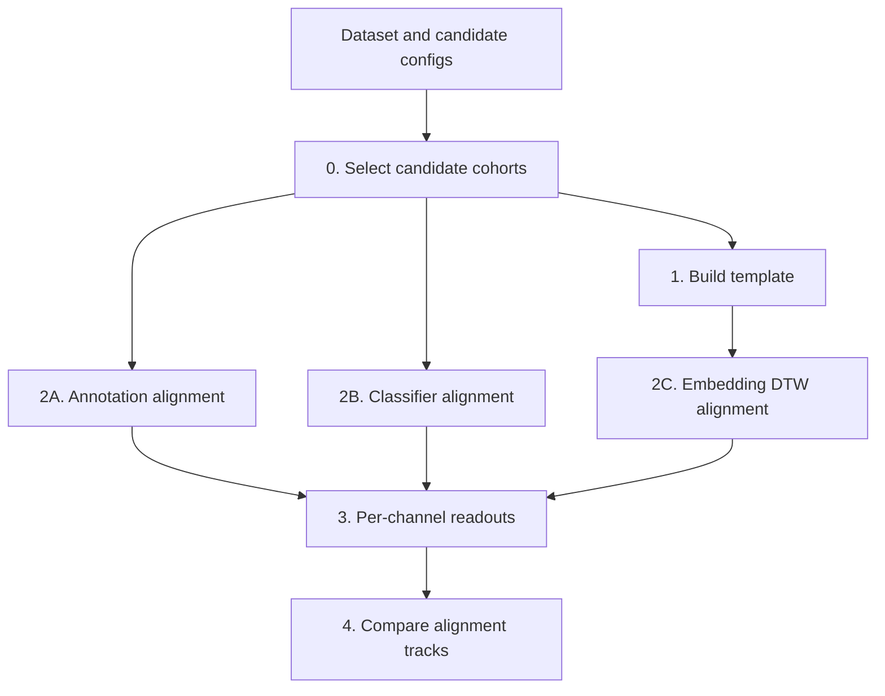

# Run the pseudotime workflow

The pseudotime scripts select candidate tracks, build an optional template,
produce three alignment variants, compute per-channel readouts, and compare the
results.



All commands below run from the repository root. The scripts write into their
stage directories under `applications/dynaclr/scripts/pseudotime/`.

## Config files

| Config | Used by | Required content |
| --- | --- | --- |
| [`datasets.yaml`](../../configs/pseudotime/datasets.yaml) | every stage | dataset paths, frame intervals, embedding patterns |
| [`candidates.yaml`](../../configs/pseudotime/candidates.yaml) | candidate selection, A-anno, A-LC, readouts | candidate sets and cohort rules |
| [`build_template.yaml`](../../configs/pseudotime/build_template.yaml) | template build and self-check | template names, input candidate set, channel, preprocessing |
| [`align_cells.yaml`](../../configs/pseudotime/align_cells.yaml) | DTW alignment and scoring | query sets, channel, dataset filters, time requirements |
| [`compare_tracks.yaml`](../../configs/pseudotime/compare_tracks.yaml) | final comparisons | candidate set, tracks, channels, output aggregation |

Keep dataset IDs, candidate-set names, template names, and query-set names
consistent across the configs.

## 0. Select candidate cohorts

```sh
uv run python applications/dynaclr/scripts/pseudotime/0-select_candidates/select_candidates.py \
  --datasets applications/dynaclr/configs/pseudotime/datasets.yaml \
  --config applications/dynaclr/configs/pseudotime/candidates.yaml \
  --candidate-set <candidate-set>
```

Outputs:

```text
applications/dynaclr/scripts/pseudotime/0-select_candidates/candidates/
├── <candidate-set>_productive.csv
├── <candidate-set>_bystander.csv
├── <candidate-set>_abortive.csv
├── <candidate-set>_unannotated_productive.csv
├── <candidate-set>_mock.csv
└── <candidate-set>_funnel.md
```

Review the funnel report and cohort row counts before continuing.

Template construction uses a separate artifact contract:
`<template-candidate-set>_annotations.csv`. The current
`select_candidates.py` command writes cohort CSVs, not this template annotation
file. Use an existing reviewed annotation file in the candidates directory or a
manual candidate generator before Stage 1.

## 1. Build and check a template

```sh
uv run python applications/dynaclr/scripts/pseudotime/1-build_template/build_template.py \
  --datasets applications/dynaclr/configs/pseudotime/datasets.yaml \
  --config applications/dynaclr/configs/pseudotime/build_template.yaml \
  --template <template-name>
```

The selected template entry identifies its input candidate set and channel.
The script reads:

```text
applications/dynaclr/scripts/pseudotime/0-select_candidates/candidates/
  <template-candidate-set>_annotations.csv
```

and writes:

```text
applications/dynaclr/scripts/pseudotime/1-build_template/templates/
  template_<template-name>.zarr
```

Run the self-alignment check:

```sh
uv run python applications/dynaclr/scripts/pseudotime/1-build_template/evaluate_template.py \
  --datasets applications/dynaclr/configs/pseudotime/datasets.yaml \
  --config applications/dynaclr/configs/pseudotime/build_template.yaml \
  --template <template-name> \
  --flavor raw
```

Use `--flavor pca` to check the stored PCA flavor.

## 2. Generate alignments

Annotation-anchored alignment:

```sh
uv run python applications/dynaclr/scripts/pseudotime/2-align_cells/align_anno.py \
  --datasets applications/dynaclr/configs/pseudotime/datasets.yaml \
  --config applications/dynaclr/configs/pseudotime/candidates.yaml \
  --candidate-set <candidate-set> \
  --anchor-label infection_state \
  --anchor-positive infected
```

Classifier-anchored alignment:

```sh
uv run python applications/dynaclr/scripts/pseudotime/2-align_cells/align_lc.py \
  --datasets applications/dynaclr/configs/pseudotime/datasets.yaml \
  --config applications/dynaclr/configs/pseudotime/candidates.yaml \
  --candidate-set <candidate-set> \
  --pred-column predicted_infection_state \
  --positive-value infected \
  --min-run 3
```

Template/embedding alignment:

```sh
uv run python applications/dynaclr/scripts/pseudotime/2-align_cells/align_embedding.py \
  --datasets applications/dynaclr/configs/pseudotime/datasets.yaml \
  --config applications/dynaclr/configs/pseudotime/align_cells.yaml \
  --template <template-name> \
  --flavor raw \
  --query-set <query-set> \
  --candidate-set <candidate-set> \
  --min-match-minutes 360 \
  --max-skew 0.8
```

The outputs are:

```text
applications/dynaclr/scripts/pseudotime/2-align_cells/
├── A-anno/alignments/<candidate-set>.parquet
├── A-LC/alignments/<candidate-set>.parquet
└── B/alignments/<template>_<flavor>_on_<query-set>.parquet
```

`--candidate-set` on the DTW command joins cohort and lineage metadata; the
filename still uses `query-set`. Stage 3 discovers Path-B input with the pattern
`*_on_<candidate-set>.parquet`, so the query-set and candidate-set names must
match for automatic lookup, or the Path-B output must be placed under that
expected name.

Review the Path-B `.drop_log.json`, track count, match duration, normalized
cost, and path-skew distribution before computing readouts.

## 3. Compute per-channel readouts

Run each required readout for each alignment track:

```sh
uv run python applications/dynaclr/scripts/pseudotime/3-organelle-remodeling/readout_sec61.py \
  --datasets applications/dynaclr/configs/pseudotime/datasets.yaml \
  --config applications/dynaclr/configs/pseudotime/candidates.yaml \
  --candidate-set <candidate-set> \
  --track A-anno

uv run python applications/dynaclr/scripts/pseudotime/3-organelle-remodeling/readout_g3bp1.py \
  --datasets applications/dynaclr/configs/pseudotime/datasets.yaml \
  --config applications/dynaclr/configs/pseudotime/candidates.yaml \
  --candidate-set <candidate-set> \
  --track A-anno

uv run python applications/dynaclr/scripts/pseudotime/3-organelle-remodeling/readout_phase.py \
  --datasets applications/dynaclr/configs/pseudotime/datasets.yaml \
  --config applications/dynaclr/configs/pseudotime/candidates.yaml \
  --candidate-set <candidate-set> \
  --track A-anno
```

Repeat with `--track A-LC` and `--track B`. Outputs are written under:

```text
applications/dynaclr/scripts/pseudotime/3-organelle-remodeling/
  <track>/<channel>/
```

## 4. Compare tracks

```sh
uv run python applications/dynaclr/scripts/pseudotime/4-compare_tracks/compare_onsets.py \
  --datasets applications/dynaclr/configs/pseudotime/datasets.yaml \
  --config applications/dynaclr/configs/pseudotime/compare_tracks.yaml \
  --comparison <comparison-name>

uv run python applications/dynaclr/scripts/pseudotime/4-compare_tracks/warp_vs_no_warp.py \
  --datasets applications/dynaclr/configs/pseudotime/datasets.yaml \
  --config applications/dynaclr/configs/pseudotime/compare_tracks.yaml \
  --comparison <comparison-name>

uv run python applications/dynaclr/scripts/pseudotime/4-compare_tracks/bimodality_check.py \
  --datasets applications/dynaclr/configs/pseudotime/datasets.yaml \
  --config applications/dynaclr/configs/pseudotime/compare_tracks.yaml \
  --comparison <comparison-name>
```

Comparison CSVs and figures are written under
`applications/dynaclr/scripts/pseudotime/4-compare_tracks/comparisons/`.

## Optional alignment scoring

Score a Path-B parquet against a label column:

```sh
uv run python applications/dynaclr/scripts/pseudotime/2-align_cells/score_alignment.py \
  --datasets applications/dynaclr/configs/pseudotime/datasets.yaml \
  --config applications/dynaclr/configs/pseudotime/align_cells.yaml \
  --template <template-name> \
  --flavor raw \
  --query-set <query-set> \
  --truth-column infection_state \
  --truth-positive infected \
  --method dtw
```

Supported comparison methods are `dtw`, `lc_onset`, and `no_align`.

## Validation checklist

- All config names resolve before running downstream stages.
- Candidate and alignment parquets have non-zero tracks and unique frame keys.
- Template self-alignment succeeds for both required flavors.
- DTW drop logs contain no unexpected dominant failure category.
- Every comparison input exists for every track and channel listed in
  `compare_tracks.yaml`.
