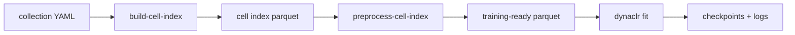

# Train a DynaCLR model

Build a training-ready cell index from an AI-ready dataset collection, then run
the Lightning training config.



## Inputs

- AI-ready zarrs with `focus_slice` and `normalization` metadata; see
  [ai_ready_datasets.md](ai_ready_datasets.md).
- Tracking zarrs.
- A collection YAML under
  [`applications/dynaclr/configs/collections/`](../../configs/collections/).
- A training YAML under
  [`applications/dynaclr/configs/training/`](../../configs/training/).

The collection maps each experiment to its image store, tracking store,
channels, wells, and timing metadata:

```yaml
name: <collection-name>
experiments:
  - name: <experiment-name>
    data_path: /path/to/dataset.zarr
    tracks_path: /path/to/tracking.zarr
    channels:
      - name: "raw GFP EX488 EM525-45"
        marker: G3BP1
    perturbation_wells:
      control: [C/1]
      perturbed: [C/2]
    interval_minutes: 30.0
    pixel_size_xy_um: 0.1494
    pixel_size_z_um: 0.174
```

## Build and preprocess the cell index

Run both steps through Nextflow:

```sh
module load nextflow/24.10.5

nextflow run applications/dynaclr/nextflow/main.nf \
  -entry training_preprocessing \
  --collection_yaml applications/dynaclr/configs/collections/<name>.yml \
  --parquet_out /path/to/collections/<name>.parquet \
  --focus_channel Phase3D \
  --workspace_dir /hpc/mydata/eduardo.hirata/repos/viscy \
  -resume
```

Equivalent direct commands:

```sh
uv run dynaclr build-cell-index \
  applications/dynaclr/configs/collections/<name>.yml \
  /path/to/collections/<name>.parquet \
  --num-workers 8

uv run dynaclr preprocess-cell-index \
  /path/to/collections/<name>.parquet \
  --focus-channel Phase3D
```

`preprocess-cell-index` updates the parquet in place unless `--output` is set.
It adds focus and normalization fields and removes empty frames.

## Training config

Training leaves compose reusable recipes with `base:`:

```yaml
base:
  - ../recipes/trainer/fit.yml
  - ../recipes/topology/ddp_2gpu.yml
  - ../recipes/model/contrastive_encoder_convnext_tiny.yml

trainer:
  precision: bf16-mixed
  max_epochs: 150

data:
  cell_index_path: /path/to/collections/<name>.parquet
```

The complete model, data, augmentation, and trainer settings must resolve to a
valid Lightning config. Use an existing leaf in the training config directory
as the starting point.

## Train

Interactive or allocated-node run:

```sh
uv run dynaclr fit -c applications/dynaclr/configs/training/<model>.yml
```

SLURM run:

```sh
sbatch applications/dynaclr/configs/training/<model>.sh
```

Resume behavior is defined by the model's SLURM wrapper. For wrappers that read
`CKPT_PATH`:

```sh
CKPT_PATH=/path/to/last.ckpt \
  sbatch applications/dynaclr/configs/training/<model>.sh
```

## Outputs and checks

- The cell-index parquet contains the expected experiments, markers, focus
  indices, and normalization columns.
- Training writes checkpoints and logger output under the run directory.
- Preserve the collection YAML, resolved training YAML, and checkpoint together
  so inference can reproduce the feature space.

Continue with [inference_triplet.md](inference_triplet.md) or the full
[evaluation.md](evaluation.md) workflow.
