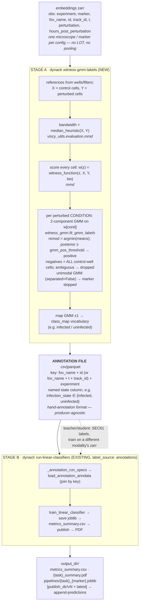
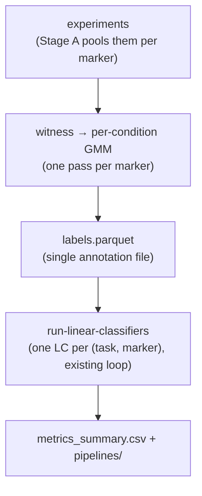

# Witness-GMM annotations → linear classifiers DAG

**Written:** 2026-07-16
**Status:** Active. Replaces the earlier witness-score classifier path
(the sign+dead-zone gate + circular annotation grading, now removed).
**Rolls up to:** `.ed_planning/dynaclr/batch_correction/per_microscope_classifier/PLAN.md`

A witness→GMM label **is an annotation**: its meaning is named by the modality it
is computed from — a witness over `viral_sensor` produces `infection_state`
(infected/uninfected); over an organelle marker, `organelle_remodeling_state`
(remodel/noremodel). So Stage A writes a **named biological-state column** with the
real class vocabulary, a file indistinguishable from a hand annotation, and the
**existing annotation training path** (`run-linear-classifiers`,
`label_source: annotations`) consumes it unchanged.

## End-to-end DAG (two stages, one existing training path)




## What's parallel vs sequential




## Recipe / config

**Stage A** — `labels_config.yml`:

```yaml
witness_gmm_labels:
  experiments:
    - experiment: "2026_04_28_A549_SEC61B_DENV"
      embeddings_zarr: ".../2-phenotyping/predictions/embeddings"
      control_filter: {perturbation: uninfected}
      perturbed_filter: {perturbation: [DENV], hours_post_perturbation: {ge: 18, lt: 24}}
  marker_filters: [viral_sensor]          # from viral_sensor → infection_state
  label_column: infection_state
  class_map: {positive: infected, negative: uninfected}
  gmm_pos_threshold: 0.8
  bandwidth: null                         # median heuristic
  max_reference_cells: 5000
  condition_column: perturbation
  output_path: ".../infection_state_witness.csv"
```

For an organelle marker: `marker_filters: [SEC61B]`,
`label_column: organelle_remodeling_state`,
`class_map: {positive: remodel, negative: noremodel}`.

**Stage B** — `train_config.yml` (the existing annotation path):

```yaml
linear_classifiers:
  label_source: annotations
  embeddings_path: ".../embeddings"       # same modality, or a phase zarr for SEC61→phase
  annotations:
    - experiment: "2026_04_28_A549_SEC61B_DENV"
      path: ".../infection_state_witness.csv"
  tasks: [{task: infection_state}]
  use_scaling: true
  split_train_data: 0.8
  split_groups_by: [experiment, fov_name, track_id]
```

Invoke:

```sh
dynaclr witness-gmm-labels -c labels_config.yml
dynaclr run-linear-classifiers -c train_config.yml
```

## Related

- Annotation training path: [evaluation.md](evaluation.md)
