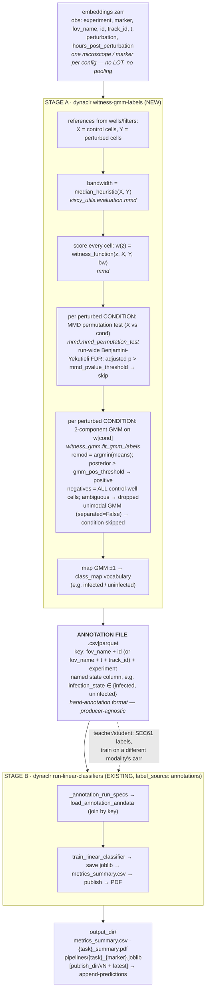
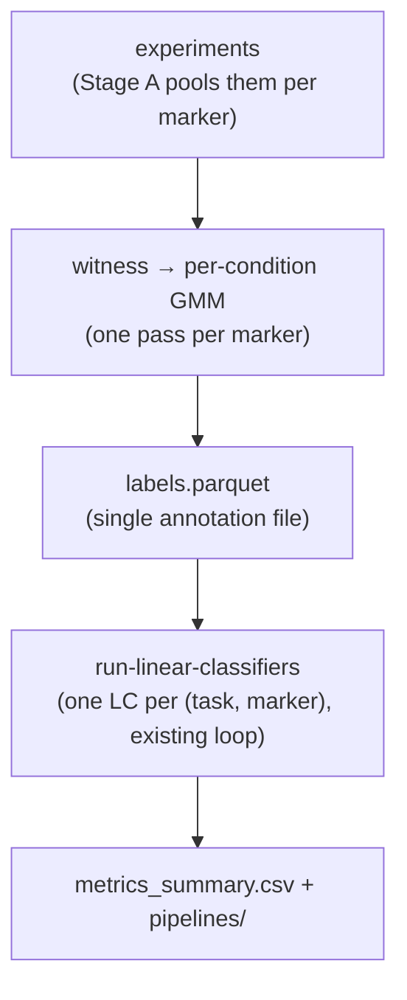
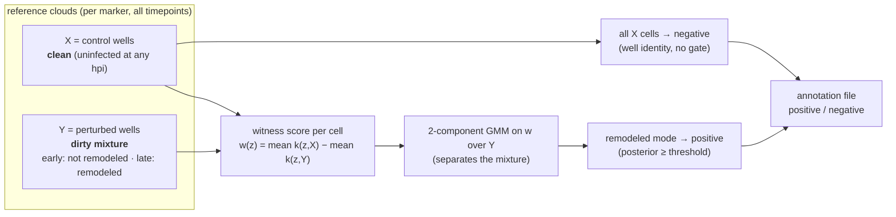

# Witness-GMM annotations → linear classifiers DAG

**Written:** 2026-07-16
**Status:** Active. Replaces the earlier witness-score classifier path
(the sign+dead-zone gate + circular annotation grading, now removed).
**Rolls up to:** `.ed_planning/dynaclr/batch_correction/per_microscope_classifier/PLAN.md`

A witness→GMM label **is an annotation**: its meaning is named by the modality it
is computed from — a witness over `viral_sensor` produces `infection_state`
(infected/uninfected); over an organelle marker, `organelle_remodeling_state`
(remodel/noremodel). So Stage A writes a **named biological-state column** with the
real class vocabulary, a file indistinguishable from a hand annotation, and the
**existing annotation training path** (`run-linear-classifiers`,
`label_source: annotations`) consumes it unchanged.

## End-to-end DAG (two stages, one existing training path)




## What's parallel vs sequential




## Reference construction & the GMM gate (why no time gate)

The two witness references are built **asymmetrically**, and this is the crux of the
method:

- **Control cloud (X) = all cells in the control/uninfected wells, all timepoints.**
  An uninfected cell looks uninfected at any hpi, so pooling every timepoint gives a
  large, *clean* reference. No gating.
- **Perturbed cloud (Y) = all cells in the perturbed wells, all timepoints.** A perturbed
  well is a **mixture**: early cells have not remodeled yet, late cells have. Y is
  therefore *dirty* by construction.

The witness `w(z) = mean k(z, X) − mean k(z, Y)` is scored against both clouds. The
**per-condition GMM is then fit on the perturbed cells' scores only** — it separates the
remodeled mode from the not-yet-remodeled mode *inside* the dirty Y. Control cells are
taken as negatives wholesale (well identity). This asymmetry is why the GMM is fit on one
side but not the other.

**No time gate by default.** A `hours_post_perturbation` window on the perturbed filter
would pre-clean Y by hand — but that discards data and re-introduces a hand-tuned
threshold, which is exactly what the GMM removes. The GMM is the principled replacement for
the time gate: it finds the remodeled sub-population within the full mixture. Add a time
gate only for a specific reason (e.g. debugging, or a marker with no clean late window).

**Significance gate (before the GMM, FDR-controlled).** Per condition, an MMD permutation
test (`mmd_permutation_test`, X vs the condition's cells) checks whether the two clouds are
*actually distinct*. Because one Stage-A run tests many (marker × condition) pairs, the raw
p-values are corrected with **Benjamini-Yekutieli FDR control**
(`scipy.stats.false_discovery_control(method="by")`) across the whole run, and a condition
is skipped when its **adjusted** p-value exceeds `mmd_pvalue_threshold` (the target FDR
level, default 0.05). A condition contributes positives only if it is **both**
FDR-significant **and** GMM-bimodal (`separated=True`); the two guard different failure
modes (references differ vs. the perturbed cloud splits cleanly). This is a **two-pass**
flow: score + p-value every condition (pass 1), BY-adjust run-wide, then GMM-label the
survivors (pass 2). Set `mmd_pvalue_threshold: 1.0` to disable the gate.



## Recipe / config

**Stage A** — `labels_config.yml`:

```yaml
witness_gmm_labels:
  experiments:
    - experiment: "2026_04_28_A549_SEC61B_DENV"
      embeddings_zarr: ".../2-phenotyping/predictions/embeddings"
      control_filter: {perturbation: uninfected}   # all uninfected cells, all timepoints
      perturbed_filter: {perturbation: [DENV]}      # all DENV cells, all timepoints (no time gate)
  marker_filters: [viral_sensor]          # from viral_sensor → infection_state
  label_column: infection_state
  class_map: {positive: infected, negative: uninfected}
  gmm_pos_threshold: 0.8
  mmd_pvalue_threshold: 0.05              # target FDR level (BY-adjusted p) for the MMD gate
  mmd_n_permutations: 1000
  bandwidth: null                         # median heuristic
  max_reference_cells: 5000
  condition_column: perturbation
  output_path: ".../infection_state_witness.csv"
```

For an organelle marker: `marker_filters: [SEC61B]`,
`label_column: organelle_remodeling_state`,
`class_map: {positive: remodel, negative: noremodel}`.

**Stage B** — `train_config.yml` (the existing annotation path):

```yaml
linear_classifiers:
  label_source: annotations
  embeddings_path: ".../embeddings"       # same modality, or a phase zarr for SEC61→phase
  annotations:
    - experiment: "2026_04_28_A549_SEC61B_DENV"
      path: ".../infection_state_witness.csv"
  tasks: [{task: infection_state}]
  use_scaling: true
  split_train_data: 0.8
  split_groups_by: [experiment, fov_name, track_id]
```

Invoke:

```sh
dynaclr witness-gmm-labels -c labels_config.yml
dynaclr run-linear-classifiers -c train_config.yml
```

## The deployable artifact (do NOT recompute the scaler / PCA)

> **Note:** each `pipelines/{task}_{marker}.joblib` is a `LinearClassifierPipeline`
> holding the **fitted** `StandardScaler`, the **fitted** `PCA` (when `use_pca: true`),
> and the logistic-regression weights — all frozen from training. Applying to a new
> dataset (`apply-linear-classifier` / `append-predictions`) calls
> `scaler.transform → pca.transform → classifier.predict_proba` — **`.transform`, never
> `.fit`**. The scaler's mean/std and PCA's rotation are **not** recomputed on new data,
> and must not be: re-fitting would re-center/re-rotate the new embeddings into a
> different space than the classifier's `w·x+b` boundary was learned in, silently
> corrupting predictions. The pipeline is embedding-only and self-contained — no witness
> references or GMM are carried into it (those live only in Stage A).
>
> **Validity condition:** reusing the frozen scaler/PCA is correct only when the new
> embeddings share the training distribution — i.e. the **same microscope / domain**.
> Under a batch shift (e.g. mantis v1 → v2) applying the frozen pipeline is mechanically
> valid but biologically off; that is why the design is **one LC per microscope** rather
> than cross-domain transfer.

## Related

- Annotation training path: [evaluation.md](evaluation.md)
