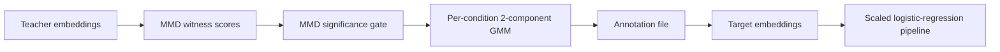

# Witness-GMM classifier training

Use the MMD witness and a Gaussian mixture model (GMM) to create confident
pseudo-labels, then train a linear classifier through the standard annotation
path.



The teacher and target embeddings may be the same modality. To transfer labels
between modalities, generate labels from the teacher modality and train on the
target modality using the shared cell identifiers.

## Label generation

For each witness marker:

1. Build the reference sets from all timepoints:
   - \(X\): cells from clean control wells.
   - \(Y\): cells from perturbed wells.
2. Select the RBF bandwidth with the median heuristic and score every cell:

   \[
   w(z) = \operatorname{mean}_{x \in X} k(z, x)
        - \operatorname{mean}_{y \in Y} k(z, y)
   \]

3. For each perturbed condition, test \(X\) against that condition with an MMD
   permutation test. Apply Benjamini-Yekutieli correction across all
   marker-condition tests in the run. Skip conditions whose adjusted
   \(p\)-value is greater than `mmd_pvalue_threshold`.
4. Fit a two-component GMM to the surviving condition's witness scores.
   - The component with the lower mean is the positive, perturbed state.
   - Label a cell positive when its posterior for that component is at least
     `gmm_pos_threshold`.
   - Skip the condition if the components are not separated.
5. Label all control-reference cells negative. Drop perturbed cells that do not
   pass the positive posterior threshold and cells outside both reference sets.

Do not add a time gate by default: the GMM is intended to separate affected and
unaffected cells within the perturbed population.

The output is an annotation file with:

- `experiment`, `fov_name`, and `id`; or `experiment`, `fov_name`, `t`, and
  `track_id`;
- the configured label column and class names, such as
  `infection_state: infected | uninfected`;
- available tracking and condition metadata.

## Stage A configuration

Use one configuration per witness marker and embedding domain.

```yaml
witness_gmm_labels:
  experiments:
    - experiment: "2026_04_28_A549_SEC61B_DENV"
      embeddings_zarr: "/path/to/teacher/embeddings.zarr"
      control_filter: {perturbation: uninfected}
      perturbed_filter: {perturbation: [DENV]}

  marker_filters: [viral_sensor]
  condition_column: perturbation
  label_column: infection_state
  class_map: {positive: infected, negative: uninfected}

  bandwidth: null
  max_reference_cells: 5000
  mmd_n_permutations: 1000
  mmd_pvalue_threshold: 0.05
  gmm_pos_threshold: 0.8
  random_seed: 42

  output_dir: "/path/to/run"
  annotation_format: csv
```

This writes:

```text
/path/to/run/labels/viral_sensor_infection_state.csv
/path/to/run/labels/plots/
```

For an organelle witness, change the marker and label vocabulary, for example:

```yaml
marker_filters: [SEC61B]
label_column: organelle_remodeling_state
class_map: {positive: remodel, negative: noremodel}
```

Generate the labels:

```sh
dynaclr witness-gmm-labels -c labels_config.yml
```

## Classifier training

Train from the generated file with `label_source: annotations`. The
`embeddings_path` is the target feature space: use the teacher embeddings for a
same-modality classifier or another modality's embeddings for label transfer.
`tasks[].marker_filters` must name the target marker.

```yaml
embeddings_path: "/path/to/target/embeddings.zarr"
output_dir: "/path/to/run/classifiers"

linear_classifiers:
  label_source: annotations
  annotations:
    - experiment: "2026_04_28_A549_SEC61B_DENV"
      path: "/path/to/run/labels/viral_sensor_infection_state.csv"
  tasks:
    - task: infection_state
      marker_filters: [viral_sensor]

  use_scaling: true
  use_pca: false
  class_weight: balanced
  split_train_data: 0.8
  split_groups_by: [experiment, fov_name, track_id]
  random_seed: 42
```

Use a group-aware split so that a track cannot appear in both training and
validation. Train the classifier:

```sh
dynaclr run-linear-classifiers -c train_config.yml
```

The command writes validation metrics, plots, and the fitted pipeline:

```text
/path/to/run/classifiers/metrics_summary.csv
/path/to/run/classifiers/infection_state_summary.pdf
/path/to/run/classifiers/pipelines/infection_state_<target-marker>.joblib
```

## Acceptance checks

- Review the MMD-null and witness-GMM plots for every accepted condition.
- Confirm that both classes have enough cells and are distributed across
  independent tracks and fields of view.
- Use validation metrics from the group-aware split, not a cell-level split.
- Apply the saved pipeline only to the same embedding feature space and domain.
  Reuse its fitted scaler and PCA; do not refit preprocessing at inference.

See [evaluation.md](evaluation.md) for the annotation training pipeline.
