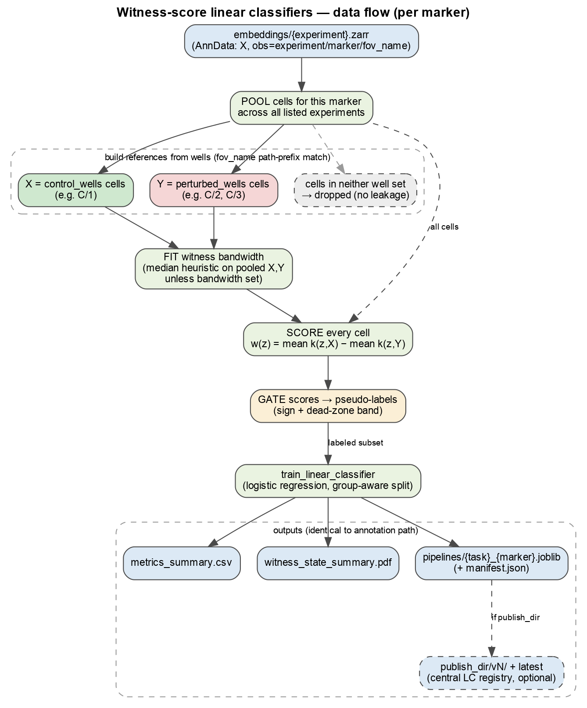
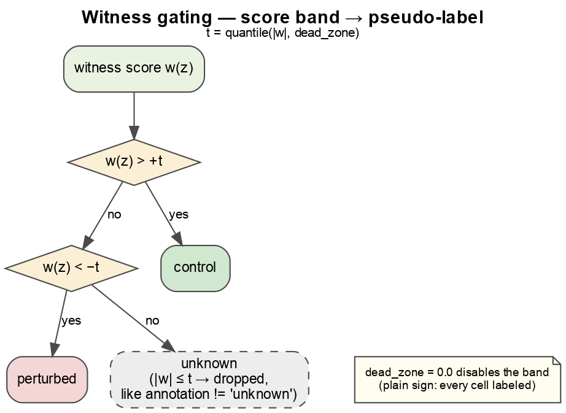
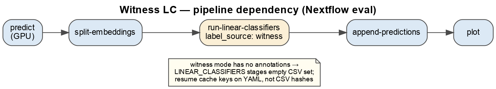
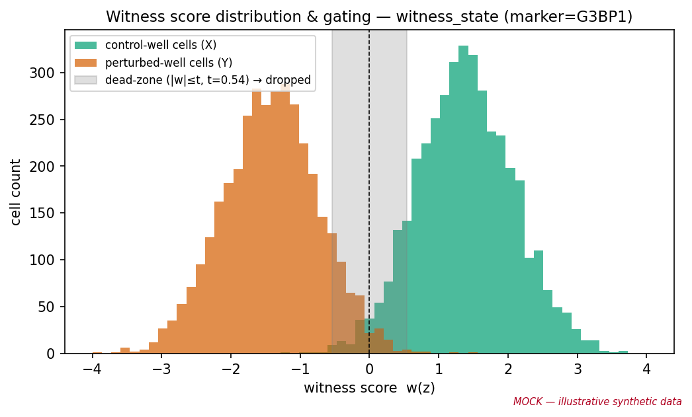
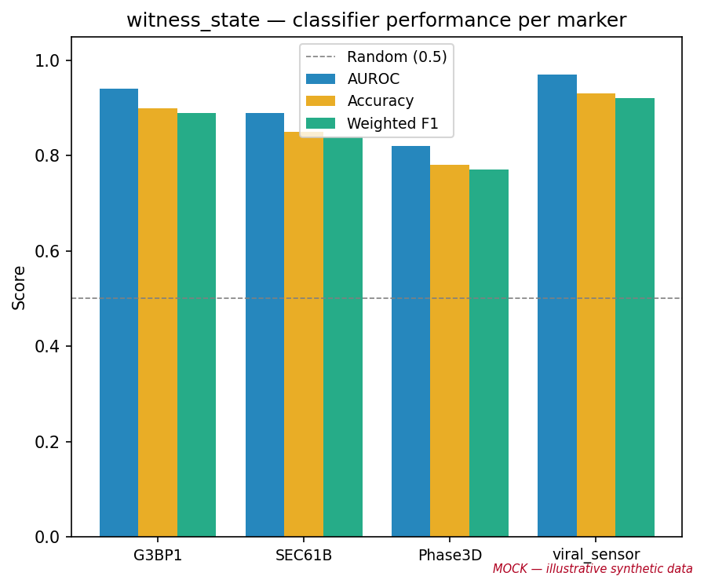
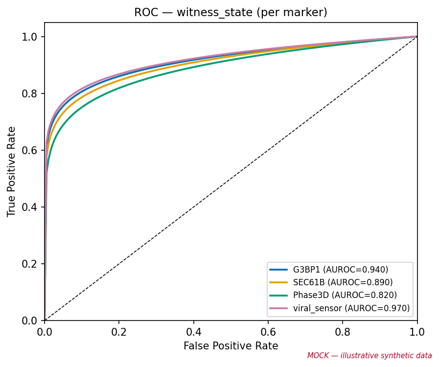
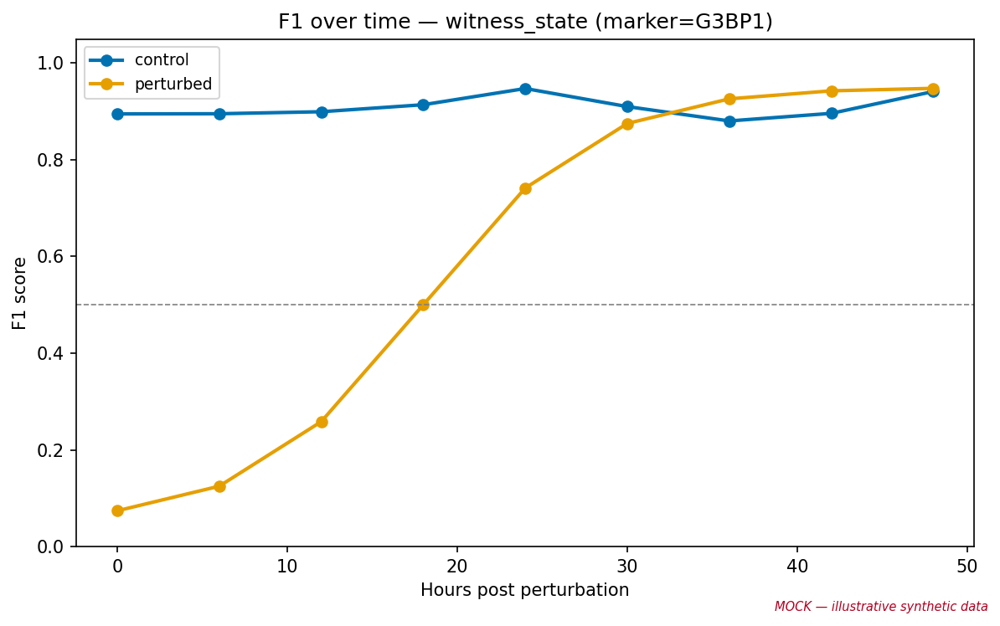

# Witness-score linear classifiers DAG

A second label source for the DynaCLR linear-classifier evaluation. Instead of
loading per-cell labels from annotation CSVs, it derives **weak labels from the
MMD witness score** using per-experiment control/perturbed wells — no
annotations required. Everything downstream (classifier training, publishing to
the LC registry, `append-predictions`, plots) is identical to the annotation
path in [evaluation.md](evaluation.md); only the label source changes.

Use this when you want infection/perturbation classifiers but do **not** have
(or do not trust) hand-annotated CSVs — the witness score gives a principled,
distribution-level proxy for "how perturbed does this cell look" that is then
gated into discrete labels.

## Visuals

Rendered from the Graphviz sources in [`visuals/`](visuals/) (edit the `.dot`
files and re-run `dot -Tpng -Gdpi=150 <name>.dot -o <name>.png` +
`dot -Tpdf <name>.dot -o <name>.pdf` to regenerate; PDFs alongside for print).

**Data flow (per marker)** — pool → build control/perturbed references → fit →
score → gate → train → outputs:



**Gating** — how a continuous score becomes a discrete label:



**Pipeline dependency** — where the step sits in the Nextflow eval:



## Mock example outputs

> ⚠️ **Illustrative synthetic data — not real results.** These mock plots show
> the *shape* of what the step produces so you know what to expect. Regenerate
> with `uv run --package dynaclr python visuals/mock_witness_plots.py`.

**Witness score distribution & gating** — the two well-defined reference groups
separate along the witness axis; the dead-zone band (gray) is dropped as
ambiguous. This is the plot to sanity-check first: if the two humps overlap
heavily, the wells are not separable and the pseudo-labels will be noisy.



The remaining three mirror the panels in `witness_state_summary.pdf` (same Wong
palette and layout as the annotation path):

**Per-marker metrics** &nbsp;·&nbsp; **ROC** &nbsp;·&nbsp; **F1 over time**







## Why the witness score

The empirical MMD witness function is the RKHS direction along which the control
distribution (X) and the perturbed distribution (Y) differ most. For a cell
embedding `z` with the Gaussian RBF kernel `k`:

```
w(z) = (1/n) Σ_i k(z, x_i)  −  (1/m) Σ_j k(z, y_j)
```

`w(z) > 0` → looks more like control; `w(z) < 0` → looks more like perturbed.
The magnitude is the per-cell contribution to MMD². It needs only two reference
groups (control vs perturbed wells), not per-cell labels.

Implementation: `viscy_utils.evaluation.mmd.witness_function` (shared with the
MMD eval), wrapped for pooling/gating in
`dynaclr.evaluation.linear_classifiers.witness_labels`.

## Step-by-step detail

```
embeddings/{experiment}.zarr   (per-experiment AnnData; obs has experiment, marker, fov_name)
  │   (produced by predict + split-embeddings — see inference_triplet.md / evaluation.md)
  ▼
dynaclr run-linear-classifiers -c linear_classifiers_witness_infectomics.yml
  │
  │  for each marker (witness.marker_filters, or every unique obs["marker"]):
  │    1. POOL cells across all listed experiments for this marker
  │    2. BUILD references from wells (obs["fov_name"] path-prefix match):
  │         X = control_wells cells,  Y = perturbed_wells cells
  │         (cells in neither well set are dropped — no leakage from dead wells)
  │    3. FIT witness bandwidth (median heuristic on pooled X,Y unless set)
  │    4. SCORE every cell: w(z) via witness_function
  │    5. GATE scores → pseudo-labels:
  │         t = quantile(|w|, dead_zone)
  │         w >  +t → control       (obs["witness_state"])
  │         w <  −t → perturbed
  │         |w| ≤ t → unknown (dropped, like annotation `!= "unknown"`)
  │    6. TRAIN logistic regression on the labeled subset
  │         (same train_linear_classifier, same group-aware split)
  ▼
output_dir/
  metrics_summary.csv              (one row per marker: accuracy, F1, AUROC, …)
  witness_state_summary.pdf        (bar chart + ROC + F1-over-time per marker)
  pipelines/{task}_{marker}.joblib (+ manifest.json)  → append-predictions
  [publish_dir/vN/ + latest]       (if publish_dir set — central LC registry)
```

## Pipeline DAG (process dependency)

```
predict  →  split-embeddings  →  run-linear-classifiers (label_source: witness)
                                        │
                                        ▼
                                  append-predictions  →  plot
```

Same shape as the annotation path — the witness label source is a drop-in swap
inside `run-linear-classifiers`. In the Nextflow eval
(`nextflow/workflows/evaluation.nf`) no module changes are needed: witness mode
has no `annotations`, so the `LINEAR_CLASSIFIERS` process stages an empty CSV
set and the recipe YAML drives everything. Resume-cache invalidation for witness
mode therefore keys on the YAML content, not on annotation-CSV hashes.

## Gating rule

Default is **sign with a symmetric dead-zone**:

| Score band                     | Label       |
| ------------------------------ | ----------- |
| `w(z) > +t`                    | control     |
| `w(z) < −t`                    | perturbed   |
| `|w(z)| ≤ t`                   | dropped     |

where `t = quantile(|w|, dead_zone)`. `dead_zone: 0.0` disables the band and
labels every cell by sign. The dead-zone is the honest analog of the annotation
path's `label != "unknown"` filter: cells too close to the decision boundary are
ambiguous and excluded from training rather than forced into a class.

## Config structure

A ready-to-edit recipe lives at
[`configs/evaluation/recipes/linear_classifiers_witness_infectomics.yml`](../../configs/evaluation/recipes/linear_classifiers_witness_infectomics.yml).
The load-bearing fields:

```yaml
linear_classifiers:
  label_source: witness           # "annotations" (default) | "witness"
  witness_labels:                 # per-experiment control/perturbed wells
    - experiment: "2025_07_24_A549_G3BP1_ZIKV"
      control_wells: ["C/1"]      # matched against obs["fov_name"] by path prefix
      perturbed_wells: ["C/2", "C/3"]
  witness:
    marker_filters: [G3BP1, SEC61B, Phase3D, viral_sensor]  # null = all markers
    label_column: witness_state   # obs column + the "task" the classifier trains on
    control_label: control
    perturbed_label: perturbed
    dead_zone: 0.1                # drop lowest-|score| 10% as unknown; 0.0 = label all
    bandwidth: null               # null = median heuristic on pooled (control, perturbed)
    max_reference_cells: 5000     # subsample each reference group to bound kernel cost
  use_scaling: true
  split_train_data: 0.8
  split_groups_by: [experiment, fov_name, track_id]   # track-level, leakage-free split
```

## What lives where

| Data                              | Location                                    | When written              |
| --------------------------------- | ------------------------------------------- | ------------------------- |
| Per-experiment embeddings         | `embeddings/{experiment}.zarr`              | predict + split           |
| Control/perturbed well spec       | recipe YAML `witness_labels`                | authored per benchmark    |
| Witness pseudo-labels             | in-memory `obs["witness_state"]` per run    | `run-linear-classifiers`  |
| Metrics + plots                   | `output_dir/metrics_summary.csv`, `*.pdf`   | `run-linear-classifiers`  |
| Trained pipelines                 | `output_dir/pipelines/` (+ optional registry) | `run-linear-classifiers`  |

## Notes

- **Wells match `obs["fov_name"]` by path component**, not string prefix: `C/1`
  matches `C/1/000000` but not `C/10/000000`. Give wells as `C/1`, `A/2`, etc.
- **Pooling is per marker across experiments.** The witness axis is fit once per
  marker on the union of all listed experiments' control/perturbed cells, so the
  learned "perturbation direction" is shared — this is what lets it generalize
  across datasets without per-experiment annotations.
- **`center_per_experiment` is not applied here.** Unlike the batch-QC MMD mode,
  the witness is fit on the raw embeddings so the control↔perturbed contrast is
  preserved. If cross-experiment batch offset dominates the witness axis, apply a
  LOT correction upstream (see [lot_correction.md](lot_correction.md)) before
  this step.
- **Labels are weak.** Val AUROC/F1 here measure separability of the *witness-
  gated* classes, not agreement with ground-truth annotations. To compare the
  two label sources head to head, run both recipes on the same embeddings and
  compare `metrics_summary.csv`.
- **The witness score is unsupervised in labels but supervised in wells** — the
  quality of the pseudo-labels is only as good as the control/perturbed well
  assignment. Mislabeling a well flips the sign for every cell in it.
```
