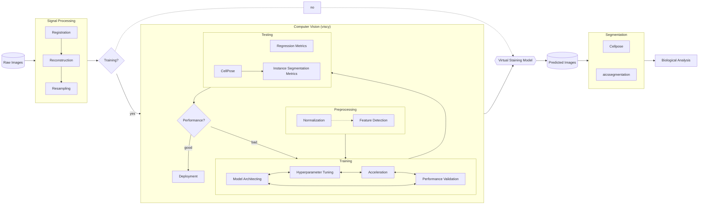

# Virtual staining of cellular compartments from label-free images

Predicting sub-cellular landmarks such as nuclei and membrane from label-free (e.g. phase) images
can improve imaging throughput and ease experiment design.
However, training a model directly for segmentation requires laborious manual annotation.
We use fluorescent markers as a proxy of supervision with human-annotated labels,
and turn this instance segmentation problem into a paired image-to-image translation (I2I) problem.

VisCy features an end-to-end pipeline to design, train and evaluate I2I models in a declarative manner.
It supports 2D, 2.5D (3D encoder, 2D decoder) and 3D U-Nets,
as well as 3D networks with anisotropic filters (UNeXt2).

## Overview of the pipeline

## Model architectures

Reported in the [2024 preprint](https://www.biorxiv.org/content/10.1101/2024.05.31.596901):

Reported in the [2020 paper](https://elifesciences.org/articles/55502v1):

