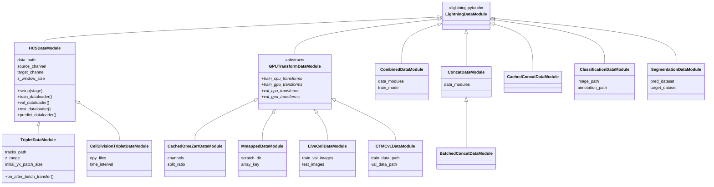
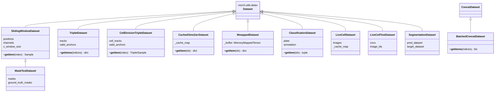
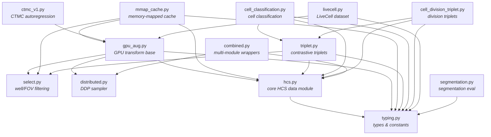
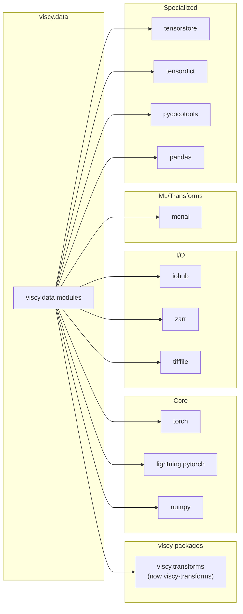
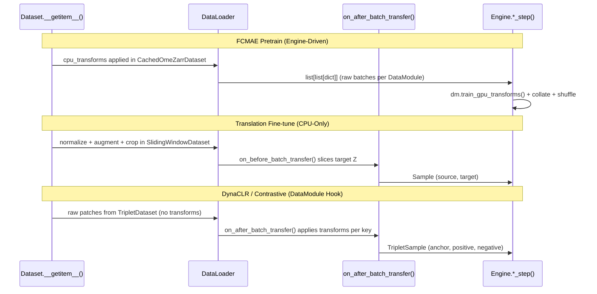

# viscy.data Module Architecture

Reference document for the `viscy/data/` module structure from the `main` branch,
created to guide extraction into a `viscy-data` subpackage.

## Module Inventory

| Module | Purpose |
|--------|---------|
| `typing.py` | Shared type definitions (Sample, ChannelMap, NormMeta, etc.) |
| `select.py` | Well/FOV filtering utilities and `SelectWell` mixin |
| `distributed.py` | `ShardedDistributedSampler` for DDP training |
| `hcs.py` | Core HCS OME-Zarr data module + sliding window dataset |
| `gpu_aug.py` | Abstract GPU transform data module + cached OME-Zarr dataset |
| `mmap_cache.py` | Memory-mapped caching dataset/data module |
| `triplet.py` | Contrastive triplet sampling from cell tracking data |
| `cell_classification.py` | Cell classification from annotation DataFrames |
| `cell_division_triplet.py` | Cell division triplet sampling from `.npy` files |
| `ctmc_v1.py` | CTMCv1 autoregression data module |
| `livecell.py` | LiveCell dataset (TIFF + COCO annotations) |
| `segmentation.py` | Segmentation evaluation data module |
| `combined.py` | Wrappers for combining/concatenating multiple data modules |

## Class Hierarchy

### LightningDataModule Inheritance



### Dataset Inheritance



## Internal Dependency Graph

Shows how modules within `viscy/data/` depend on each other.



## External Dependencies



### Dependency per module

| Module | External deps beyond torch/lightning/numpy |
|--------|--------------------------------------------|
| `typing.py` | (none) |
| `select.py` | iohub |
| `distributed.py` | (none) |
| `hcs.py` | iohub, zarr, monai, imageio |
| `gpu_aug.py` | iohub, monai |
| `mmap_cache.py` | iohub, monai, tensordict |
| `triplet.py` | iohub, monai, pandas, tensorstore, **viscy.transforms** |
| `cell_classification.py` | iohub, pandas |
| `cell_division_triplet.py` | monai |
| `ctmc_v1.py` | iohub, monai |
| `livecell.py` | monai, pycocotools, tifffile, torchvision |
| `segmentation.py` | iohub |
| `combined.py` | monai |

## Cross-package Import: viscy.transforms

`triplet.py` is the **only** module that imports from `viscy.transforms`:

```python
from viscy.transforms import BatchedCenterSpatialCropd
```

This import is used in `TripletDataModule._final_crop()` to create a batched
center crop transform. All other transform usage goes through MONAI's
`MapTransform` interface (transforms are passed in as constructor arguments).

## Key Shared Helpers (from hcs.py)

Several modules import utility functions from `hcs.py`:

| Function | Used by |
|----------|---------|
| `_ensure_channel_list()` | `gpu_aug.py`, `mmap_cache.py` |
| `_read_norm_meta()` | `gpu_aug.py`, `mmap_cache.py`, `triplet.py`, `cell_classification.py` |
| `_collate_samples()` | `combined.py` |

These should be extracted into a shared utilities module during subpackage conversion.

## SelectWell Mixin Pattern

`select.py` defines a `SelectWell` mixin class used via multiple inheritance:

```python
# gpu_aug.py
class CachedOmeZarrDataModule(GPUTransformDataModule, SelectWell): ...

# mmap_cache.py
class MmappedDataModule(GPUTransformDataModule, SelectWell): ...
```

This provides the `_filter_fit_fovs()` method for well/FOV selection.

## Training Pipeline to DataModule Mapping

Three training pipelines use different engine, DataModule, and Dataset combinations:

| Aspect | FCMAE Pretrain | Translation Fine-tune | DynaCLR (Contrastive) |
|--------|---------------|----------------------|----------------------|
| Engine class | `FcmaeUNet` | `VSUNet` | `ContrastiveModule` |
| Source | `viscy.translation.engine` | `viscy.translation.engine` | `viscy.representation.engine` |
| DataModule | `CombinedDataModule` wrapping `CachedOmeZarrDataModule` | `HCSDataModule` | `TripletDataModule` |
| Dataset | `CachedOmeZarrDataset` | `SlidingWindowDataset` | `TripletDataset` |
| Batch structure | `list[list[dict]]` &rarr; collated `Sample` | `Sample` (`source`, `target`, `index`) | `TripletSample` (`anchor`, `positive`, `negative`) |
| GPU transforms | Engine-driven: `FcmaeUNet.train_transform_and_collate()` | None (CPU-only via MONAI `Compose`) | `TripletDataModule.on_after_batch_transfer()` |
| Caching | `Manager().dict()` shared cache per FOV/timepoint | Optional zarr decompression to `/tmp` | `tensorstore` cache pool |
| DDP support | `ShardedDistributedSampler` | Standard PyTorch shuffle | Standard PyTorch shuffle (`ThreadDataLoader`) |

### FCMAE Two-Stage Workflow

FCMAE uses the same model architecture (`FullyConvolutionalMAE`) across two stages
that swap both the engine class and DataModule:

1. **Pretrain** (self-supervised MAE): `FcmaeUNet` engine with `CombinedDataModule`
   wrapping one or more `CachedOmeZarrDataModule`s. The model runs with
   `mask_ratio > 0` and `MaskedMSELoss`. GPU transforms are applied by the engine
   in `train_transform_and_collate()` / `val_transform_and_collate()`.

2. **Fine-tune** (supervised translation): `VSUNet` engine with `architecture="fcmae"`
   and `HCSDataModule`. The encoder can be frozen via `freeze_encoder=True`.
   All transforms are CPU-side MONAI `Compose` pipelines; no GPU transforms.

The checkpoint from stage 1 is loaded into stage 2 via `VSUNet(ckpt_path=...)`.

## GPU Transform Pattern Analysis

GPU augmentation is implemented three different ways across the pipelines:

### Pattern 1: Engine-Driven (FCMAE)

`GPUTransformDataModule` defines abstract properties (`train_gpu_transforms`,
`val_gpu_transforms`, etc.) but does **not** override `on_after_batch_transfer()`.
Instead, the `FcmaeUNet` engine explicitly calls transforms in its training/validation
steps:

```python
# FcmaeUNet.train_transform_and_collate()
for dataset_batch, dm in zip(batch, self.datamodules):
    dataset_batch = dm.train_gpu_transforms(dataset_batch)
```

This gives the engine full control over transform ordering, collation, and shuffling.

### Pattern 2: DataModule Hook (DynaCLR)

`TripletDataModule` overrides `on_after_batch_transfer()` to apply transforms
per-key (`anchor`, `positive`, `negative`). Each key is transformed independently
via `_transform_channel_wise()`, which scatters channels into a dict, applies
MONAI transforms, and gathers back:

```python
# TripletDataModule.on_after_batch_transfer()
for key in ["anchor", "positive", "negative"]:
    batch[key] = _transform_channel_wise(
        transform=self._find_transform(key),
        channel_names=self.source_channel,
        patch=batch[key], norm_meta=...
    )
```

### Pattern 3: CPU-Only (Translation)

`HCSDataModule` applies all transforms (normalization + augmentation + crop) on
the CPU inside dataset `__getitem__()` via MONAI `Compose`. The only
device-transfer hook is `on_before_batch_transfer()`, which only slices the
target Z dimension for 2.5D models — no GPU augmentation.

### Transform Flow Diagram



## Unification Assessment

### What Can Be Shared

- **CPU/GPU transform interface**: All three pipelines ultimately compose MONAI
  `MapTransform`s. The `train_cpu_transforms` / `train_gpu_transforms` property
  pattern from `GPUTransformDataModule` could be adopted as a standard interface.

- **iohub I/O**: `CachedOmeZarrDataset`, `SlidingWindowDataset`, and
  `TripletDataset` all read from OME-Zarr via `iohub.Position`. The
  `_read_norm_meta()` helper is already shared.

- **Caching strategy**: Both `CachedOmeZarrDataset` (Manager dict) and
  `TripletDataset` (tensorstore cache pool) implement per-volume caching. A
  common cache interface could standardize this.

### What Cannot Be Unified

- **Batch structure**: `Sample` (source/target), `TripletSample`
  (anchor/positive/negative), and the FCMAE nested list format are fundamentally
  different. Collation and transform application depend on this structure.

- **Transform application logic**: FCMAE applies transforms to a flat list then
  shuffles; DynaCLR transforms each triplet key independently with channel
  scatter/gather; translation transforms during `__getitem__()`. These reflect
  genuine differences in augmentation semantics.

- **DataLoader type**: DynaCLR uses `monai.data.ThreadDataLoader` (thread-based
  workers for GIL-friendly tensorstore I/O); FCMAE/translation use standard
  `torch.utils.data.DataLoader`.

### Recommendation: `GPUTransformMixin`

Rather than forcing all pipelines into a single base class, introduce a
`GPUTransformMixin` that standardizes the **interface** while keeping per-DataModule
`on_after_batch_transfer()` implementations:

```python
class GPUTransformMixin:
    """Standard interface for CPU/GPU transform split."""

    @property
    @abstractmethod
    def train_cpu_transforms(self) -> Compose: ...

    @property
    @abstractmethod
    def train_gpu_transforms(self) -> Compose: ...

    @property
    @abstractmethod
    def val_cpu_transforms(self) -> Compose: ...

    @property
    @abstractmethod
    def val_gpu_transforms(self) -> Compose: ...
```

This would allow:
- `CachedOmeZarrDataModule` to keep engine-driven GPU transforms (FCMAE pattern)
- `TripletDataModule` to keep its `on_after_batch_transfer()` with channel scatter/gather
- `HCSDataModule` to optionally adopt the interface with no-op GPU transforms

The mixin decouples the **declaration** of transforms from the **application**
strategy, enabling engines to query any DataModule's transforms without knowing
which pattern it uses.

## Shared Type Definitions (typing.py)

`typing.py` defines types used across both `viscy.data` and `viscy.transforms`:

| Type | Used in data | Used in transforms |
|------|-------------|-------------------|
| `DictTransform` | Yes (throughout) | Yes (extracted to `viscy_transforms._typing`) |
| `Sample` | Yes (hcs, livecell) | No |
| `ChannelMap` | Yes (hcs) | No |
| `NormMeta` | Yes (hcs, gpu_aug, triplet, mmap) | No |
| `HCSStackIndex` | Yes (hcs) | No |
| `TripletSample` | Yes (cell_division_triplet) | No |
| `SegmentationSample` | Yes (segmentation) | No |
| `AnnotationColumns` | Yes (cell_classification) | No |
| Label constants | Yes (cell_classification) | No |

During the viscy-transforms extraction (Phase 3, already completed), only
`DictTransform` and `OneOrSeq` were copied into `viscy_transforms._typing`.
The rest remain data-specific.

---

## Notes for viscy-data Subpackage Conversion

### 1. Dependency on viscy-transforms

`triplet.py` imports `BatchedCenterSpatialCropd` from `viscy.transforms`.
In a uv workspace, this becomes a package dependency:

```toml
# packages/viscy-data/pyproject.toml
[project]
dependencies = [
    "viscy-transforms",  # for BatchedCenterSpatialCropd
]
```

This is a **one-way dependency** (data -> transforms), so no circular dependency
issue. However, it couples the two packages. Consider whether
`BatchedCenterSpatialCropd` should move to viscy-data or if the dependency is
acceptable.

### 2. Heavy Optional Dependencies

Some modules have specialized dependencies that most users don't need:

| Dependency | Module(s) | Size/Impact |
|-----------|-----------|-------------|
| `tensorstore` | `triplet.py` | Large C++ library |
| `tensordict` | `mmap_cache.py` | Part of torchrl ecosystem |
| `pycocotools` | `livecell.py` | Requires C compiler |
| `tifffile` | `livecell.py` | Light |
| `pandas` | `triplet.py`, `cell_classification.py` | Common but adds weight |

**Recommendation:** Use optional dependency groups:

```toml
[project.optional-dependencies]
triplet = ["tensorstore", "pandas"]
livecell = ["pycocotools", "tifffile"]
mmap = ["tensordict"]
all = ["tensorstore", "pandas", "pycocotools", "tifffile", "tensordict"]
```

Or use lazy imports with clear error messages.

### 3. Extract Shared Utilities from hcs.py

`hcs.py` serves as both a concrete data module AND a utility library. Before
extraction, refactor shared helpers into a `_utils.py`:

```
viscy_data/
    _utils.py          # _ensure_channel_list, _read_norm_meta, _collate_samples
    _typing.py         # Sample, ChannelMap, NormMeta, etc. (from typing.py)
    hcs.py             # HCSDataModule, SlidingWindowDataset only
    ...
```

### 4. typing.py Overlap with viscy-transforms

`DictTransform` is defined in both `viscy/data/typing.py` and
`viscy_transforms/_typing.py`. For the subpackage:
- **Option A:** viscy-data re-exports from viscy-transforms (adds coupling)
- **Option B:** viscy-data defines its own copy (duplicates a one-line type alias)
- **Option C:** Create a shared `viscy-types` micro-package (over-engineering)

**Recommendation:** Option B -- keep a local copy. `DictTransform` is a single
`Callable` type alias and duplication is preferable to adding a dependency just
for a type.

### 5. HCSDataModule as Base Class

`HCSDataModule` is the parent of `TripletDataModule` and
`CellDivisionTripletDataModule`. This inheritance means these three must stay in
the same package. The class is also tightly coupled to iohub's `Position` and
`Plate` types.

### 6. GPUTransformDataModule Abstract Pattern

`GPUTransformDataModule` is an abstract base that standardizes the CPU/GPU
transform split pattern. Four modules inherit from it (`CachedOmeZarrDataModule`,
`MmappedDataModule`, `LiveCellDataModule`, `CTMCv1DataModule`). This is a clean
abstraction that works well as a package-internal base class.

### 7. combined.py Module Size

`combined.py` contains 5 classes (`CombineMode`, `CombinedDataModule`,
`BatchedConcatDataset`, `ConcatDataModule`, `BatchedConcatDataModule`,
`CachedConcatDataModule`). Consider splitting into:
- `combined.py` -- `CombinedDataModule` (uses Lightning's `CombinedLoader`)
- `concat.py` -- `ConcatDataModule`, `BatchedConcatDataModule`, `CachedConcatDataModule`

### 8. MONAI Dependency Depth

Nearly every module depends on MONAI for transforms, data utilities, or
`set_track_meta`. MONAI is a large dependency (~hundreds of MB with all
transitive deps). This is unavoidable given the project's design, but worth
noting for install time. MONAI should be a required dependency, not optional.

### 9. iohub as Core I/O Dependency

Most data modules read from HCS OME-Zarr stores via `iohub`. This is a
required dependency. The `Position`, `Plate`, `Well`, and `ImageArray` types
from `iohub.ngff` are used extensively. Any change in iohub's API would require
coordinated updates.

### 10. Distributed Training Support

`distributed.py` provides `ShardedDistributedSampler` used by `gpu_aug.py`,
`mmap_cache.py`, and `combined.py`. This handles DDP sharding and should stay
as an internal utility within viscy-data.

### 11. Suggested Package Layout

```
packages/viscy-data/
    src/viscy_data/
        __init__.py
        _typing.py              # from typing.py (data-specific types)
        _utils.py               # shared helpers extracted from hcs.py
        select.py               # well/FOV filtering
        distributed.py          # DDP utilities
        hcs.py                  # HCSDataModule + SlidingWindowDataset
        gpu_aug.py              # GPUTransformDataModule + CachedOmeZarrDataset
        mmap_cache.py           # MmappedDataModule
        triplet.py              # TripletDataModule
        cell_classification.py  # ClassificationDataModule
        cell_division_triplet.py
        ctmc_v1.py
        livecell.py
        segmentation.py
        combined.py             # CombinedDataModule
        concat.py               # Concat variants
    tests/
        ...
    pyproject.toml
    README.md
```
